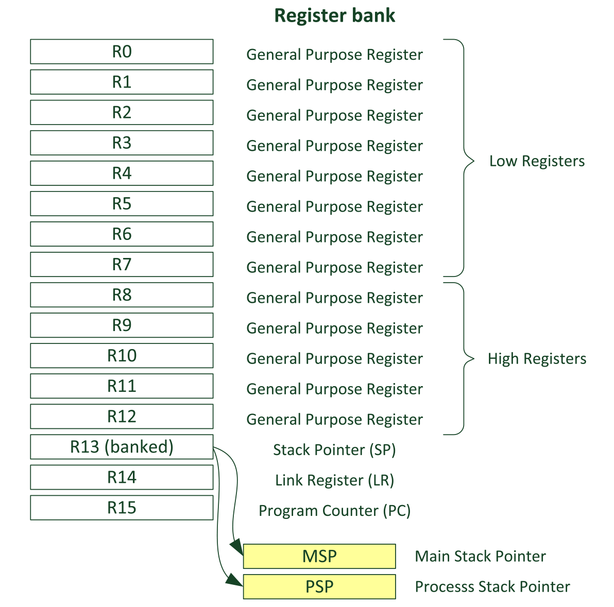
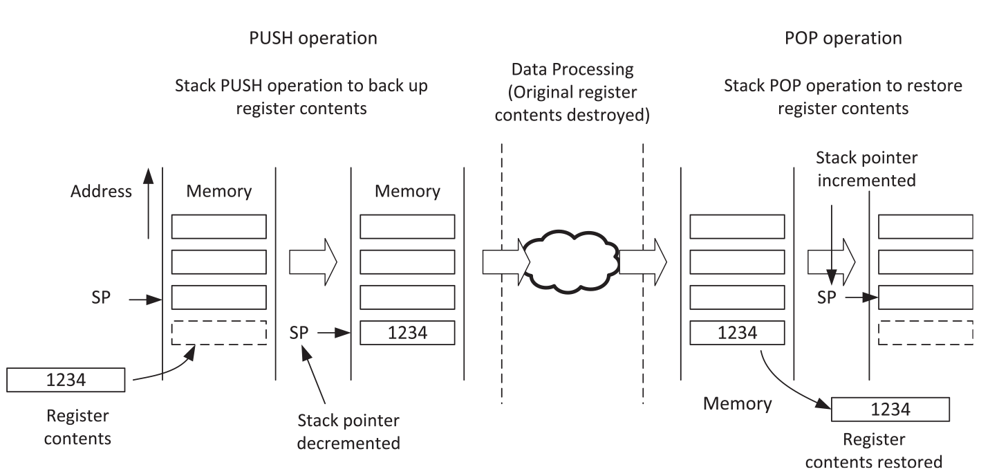
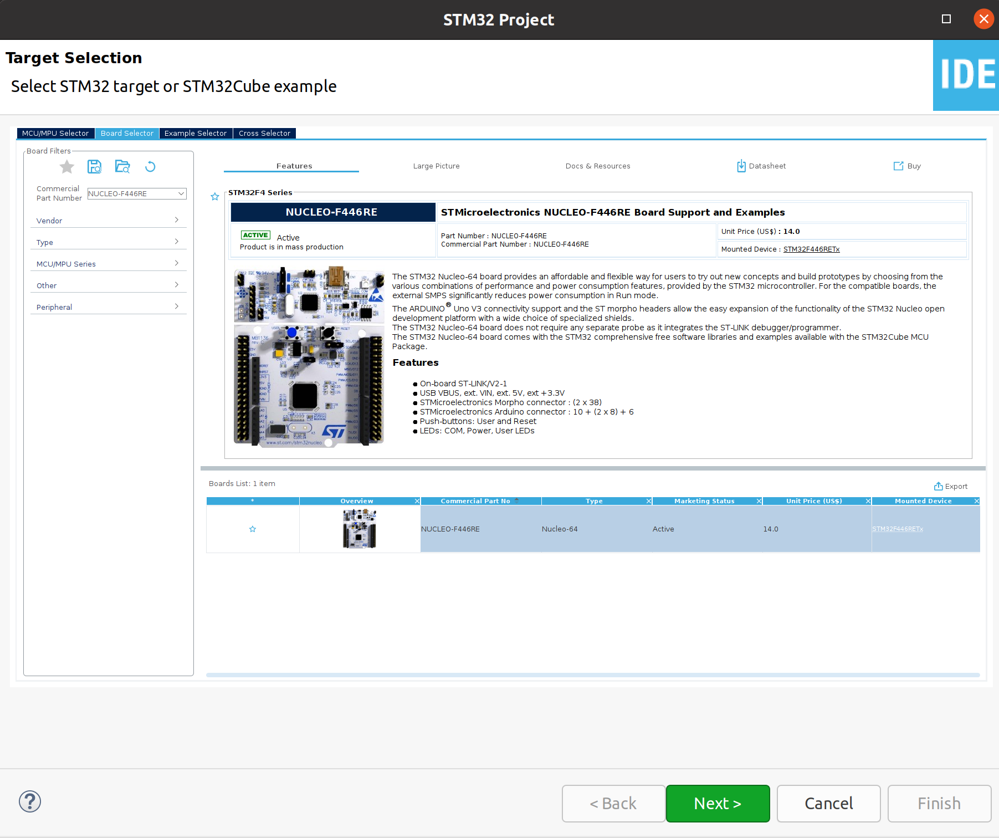
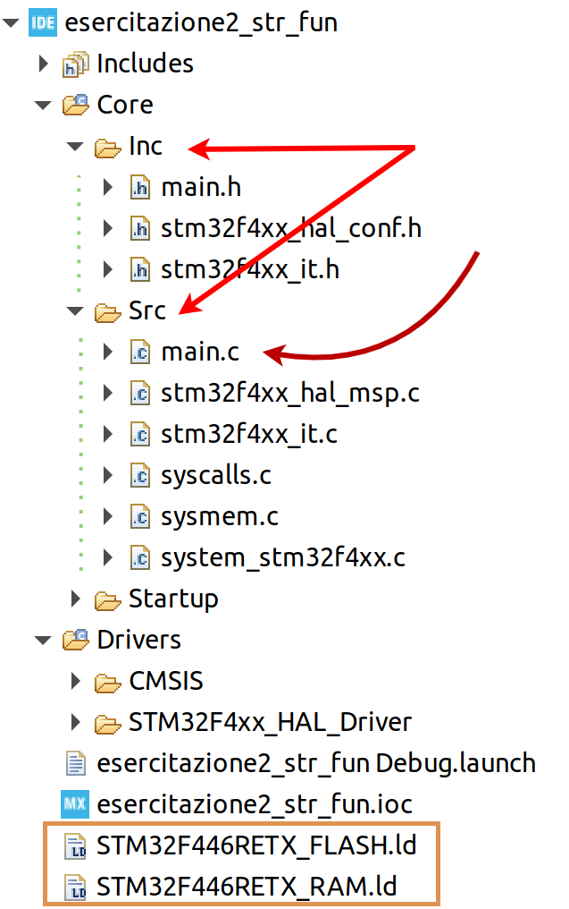
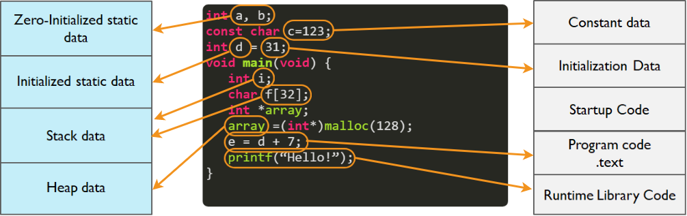

# First approach to hardware architecture: Analisys and Programming

</br>

## Overview 
This lesson is focused on programming microcontroller of type **STM32** and series **F4**, starting with two simple functions about string processing:
* `c_strcpy(const char *src, char *dst)`: copy the content of the string (`src`) into the other one (`dst`) both passed to the function by references;
* `c_strcapitalize(char *str)`: transforms all the characters of the string (`str`) into uppercase.
Although the functions to be written are very simple, the purpose is to analyze the internal functioning of the architecture, visualizing what happens in the registers and in the memory of the microcontroller by performing the functions indicated above. We will use the development environment [**STM32Cube**](https://www.st.com/en/development-tools/stm32cubeide.html) and the development board **STM32F446RE** used in *debug mode* thanks to the **ST-Link** module already present on the board.

## ARM Architecture: Registers
The **ARM** architecture is a *load-store* type architecture: if some informations stored into memory need to be processed it is necessary to move them from the memory into the registers located in the area indicated as *register bank*. The data is then processed by the processor and subsequently reloaded into memory.
In other words direct operation memory-memory are not allowed.

Thanks to a sufficient number of registers, this quite simple mechanism allows to generate efficient software.

<p align = "center">
  
</p>

### R0 - R12
  > Registers R0 to R12 are general purpose registers. The first eight (R0 and R7) are also called low registers. Due to the limited available space in the instruction set, many 16-bit instructions can only access the low registers. The high registers (R8 and R12) can be used with 32-bit instructions, and a few with 16-bit instructions. The initial values ​​of R0 to R12 are undefined
  
### R13, stack pointer (SP)
  > R13 is the Stack Pointer. It is used for accessing the stack memory via PUSH and POP operations. Physically there are two different Stack Pointers: the Main Stack Pointer (MSP) is the default Stack Pointer. It is selected after reset, or when the processor is in Handler Mode. The other Stack Pointer is called the Process Stack Pointer (PSP) and can only be used in Thread Mode. The selection of Stack Pointer is determined by a special register called CONTROL. For most cases, it is not necessary to use the PSP if the application doesn't require an embedded OS.

In most applications, only one **Stack Pointer** is visible and the operating modes are limited.

:dart:
When the memory is organized accordig to the **stack** logic, it means that the memory is exploited as a *LIFO* buffer(*L*ast-*I*n-*F*irst-*O*ut) that, in this context, is refereced with the name **stack**.
The instructions used to handle this structure are *PUSH* and *POP*, the former is used to load data onto the **stack** while the latter is used to extract what is stored "at the top" of the **stack**.

The **stack pointer** is a pointer that always points to the top of the **stack** and is automatically updated after each *PUSH* or *POP* instruction. When using these instructions the programmer must also provide the memory address where the informations needs-to-be/are stored.

The elements stored into the **stack** can consist of:

* Local variables that are stored temporarily;
* Data that must be passed from a function to a sub-function (*subroutine*);
* Values ​​relating to the state of the processor and registers in the event of an exception.

Figuratively, the **stack** is represented as a memory that "grows down"; this imaginative concept derives from the fact that on the **stack** the processor operates according to the model called "full-descending stack": when the processor is started, the **SP** is set with the value of the last memory address reserved for the **stack** and will move to numerically lower-value addresses. Following a *PUSH* operation, the **SP** is decremented and a value is subsequently inserted to the memory location pointed to by the **SP**. For a *POP* operation, on the other hand, the value found in the memory area pointed to by the **SP** is taken and subsequently increased.



Note that for every *PUSH* operation there must be a corresponding *POP* operation sooner or later, in order to properly use the memory allocated for the **stack**.

### R14, link register (LR) 
> R14 is also called the Link Register (LR). This is used to hold the return address when calling a function or subroutine. At the end of the function or subroutine, the program control can return to the calling program and resume by loading the value of LR into the Program Counter (PC). When a function or subroutine call is made, the value of LR is updated automatically. If a function needs to call another function or subroutine, it needs to save the value of LR in the stack first. Otherwise, the current value in LR will be lost when the function call is made. During exception handling, the LR is also updated automatically to a special EXC_RETURN (Exception Return) value, which is then used for triggering the exception return at the end of the exception handler.
  
### R15, program counter (PC)
> R15 is the Program Counter (PC). It is readable and writeable: a read returns the current instruction address plus 4 (this is due to the pipeline nature of the design, and compatibility requirement with the ARM7TDMI processor). Writing to PC (e.g., using data transfer/processing instructions) causes a branch operation. Other architectures may use the Program Counter to store the address of the next instruction to be executed.

##

When one function calls another, the return address is put in the *link register* (**LR**). The parameters of the function, if any, are loaded into the first 4 registers, from **R0** to **R3** and if there are more than four arguments, or if these are dimensionally greater than 32 bits, these are passed on the stack.

These same register can be used to store temporary data if they are not already busy holding arguments for functions or if the arguments in the logs are no longer needed. 
In other words the **LR** register is not read-only.

The registers from **R4** to **R11**, on the other hand, tend to be preserved for the *subroutines*; if there is a need to use any, the contained value is temporarily put on the stack (buckup operation) and then reloaded (restore operation).

##

In addition to all the registers in the *register bank*, there are a series of registers considered *special*, that contain information about the state of the processor and allow to define more elaborate operational situations than those concerning the development of simple applications. For example, in C, this **special** registers are often exploited when developing embedded operating systems or even more complex applications.

##

For more detailed information regarding the operation of the registers and their use, refer to the [Reference Manual](https://www.st.com/resource/en/reference_manual/dm00135183.pdf).


## Working with STM32Cube
To carry out the tutorial, we implement a main function (`int main ()`) initially making use of the *code generation* features provided by the *STM32Cube* development environment. In the body of the application, the two functions are invoked, implemented outside the main method, and what happens in the registers of the microcontroller is analyzed through the debug interface.

<br>

:pencil: **`c_strcpy(const char *src, char *dst)`**

The function accepts two input parameters, each of which is a pointer to an array of chars. Based on the above, the two pointers are passed as arguments using the registers between **R0** and **R7**, depending on the current availability of the microcontroller.

The compilation tools for **ARM** are capable of compiling C code, Assembly or a suitable combination of both, producing a single executable. This allow the programmer to write the desired function also in Assembly code, integrating it into C code files.

When writing Assembly code for processors of this type you need to make sure that it respects the standard:
*"Procedure Call Standard for the ARM Architecture (AAPCS)"*, that determines some specific rules that both the calling and called function must follow. For example, some specific rules (all rules available at official [website](https://static.docs.arm.com/ihi0042/i/aapcs32.pdf)) are: </br>
> Registers **R0-R3** pass argument values to the callee function, with subsequent arguments passed on the stack.
</br></br> Register **R0** passes the result value back to the caller function.
</br></br> Caller functions must preserve **R0-R3** and **R12**, because these registers are allowed to be corrupted by the callee function.
</br></br> Callee functions must preserve **R4-R11** and **LR**, since these registers should not be corrupted by the callee function. In other words, if the callee function uses the **R4-R11** and **LR** registers, it must save the values stored in these registers and restore these values before the return instruction. 

<br>

The implementation of the **`c_strcpy (const char * src, char * dst)`** function is done within a *STM32 Project*, created using the **STM32Cube** development environment; the creation of a project of this type involves the selection of a microcontroller or a development board *target*.
<p align="center">
  
</p>

For this first example, the *pins* of the microcontroller will maintain their default configuration since we are not interested in managing them in anyway. However, for this lesson it is more important to get used to the development environment and the project folders that are automatically created by the IDE.

<p align="center">
    
</p>

The function in question will be implemented inside the `main.c` file and called inside the` int main (void) `function found in this file. Shown below is a portion of the *debug* interface of the development environment; through this interface it is possible to analyze the content of all the registers of the *register bank* and view the values assumed by the program variables.

***
The analysis of the product code is important to determine, also in terms of storage, where the written code will be saved. For example, while constant arrays are saved in the *stack*, those that are initialized via functions like `malloc` reside in the *heap*. Other pieces of code instead, which is compiled, remain saved in the flash memory of the microcontroller.



For a correct development of an embedded system, it may be important to also take into account the resources (in terms of *Kbytes* of flash memory or *Kbytes* of SRAM) available in order to optimize the developed code.

***

:bookmark: For everything about the **ST-Link** module for programming and debugging the microcontroller, refer to the [official page](https://www.st.com/en/development-tools/st-link-v2.html), on which there are also the drivers necessary to use the module on Windows 7/8/10 systems.

***

### Programming in Assembly with STM32Cube
The ARM compiler present within the development environment *STM32Cube* allows the writing of assembly code within the C source code, as specified in the [official ARM documentation](https://developer.arm.com/documentation/100748/0615/Using-Assembly-and-Intrinsics-in-C-or-C---Code/Writing-inline-assembly-code).

To use this compiler directive, you need to use the keyword `__asm`, which basically identifies some sort of *function call* and allows you to embed assembly (inline) code inside a C function using the [compiler-defined syntax GNU](https://gcc.gnu.org/onlinedocs/gcc/Extended-Asm.html). This makes it possible to include a single or even multiple assembly instructions within a C function.

As an example, the assembly function that performs the mathematical sum indicated below is implemented using the inline assembly programming:


```c
int asm_square_sum(int n){
  __asm ( "mov r1, #0\n"        //r1 = sum = 0
          "mov r2, #1\n"        //r2 = i = 1
          "loop1: cmp r2, r0\n" //i>n?
          "bgt done1\n"         //True, jump to 'done'
          "mul r3, r2, r2\n"    //temp = i*i
          "add r1, r3\n"        //sum += temp
          "add r2, #1\n"        //i++
          "b loop1\n"
          "done1:\n"
          "mov r0, r1");
}
```
The code shows the simpler way of writing multiple assembly instructions; note that each statement is defined within a string (delimited by `"`) ending with the`\n` character. All strings are then passed to the `__asm()` function, which is encapsulated within of a normal C function whose operand (the integer `n`) is passed to the function via the `R0` register.

</br></br>


## Exercises
:pencil: Translate the following C function into Assembly code:
```c
int c_strlen(char *s) { 
  int i = 0; 
  
  while ( s[i] != '\0' ) 
    i++; 
  
  return i; 
}
```

:pencil: Write in Assembly code a `main` function in which the calculation of the sum indicated below is performed.


Use the **R0** register for the *n* variable, the **R1** register to keep the result (*sum* variable) and another register of your choice to keep the *i* variable that must increase up to to the value *n*.

Then implement the function in C and evaluate, through debug mode, which registers are used and how.

:interrobang: Briefly explain the operation and differences between the **MOV**, **MVN** and **MOVT** functions.

:question: How many registers do you need to keep the result of an operation like **UMLAL**?
