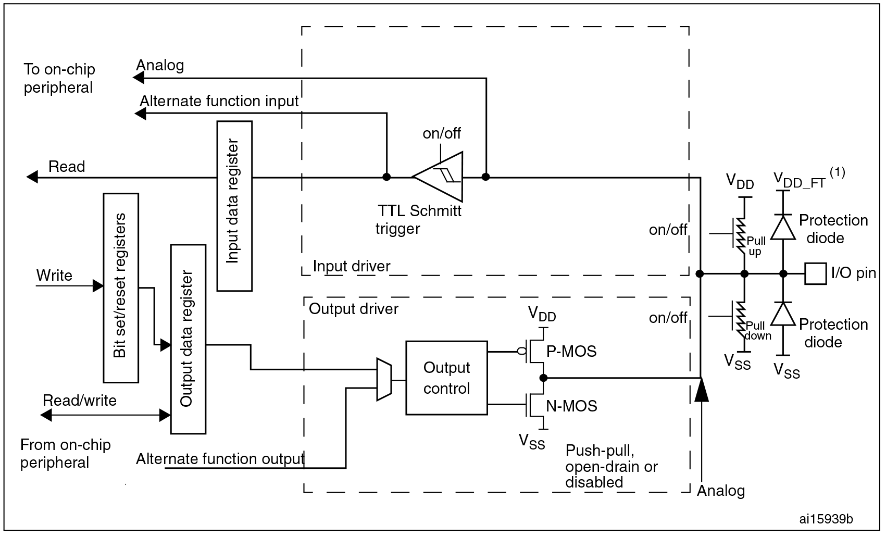
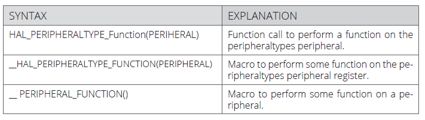
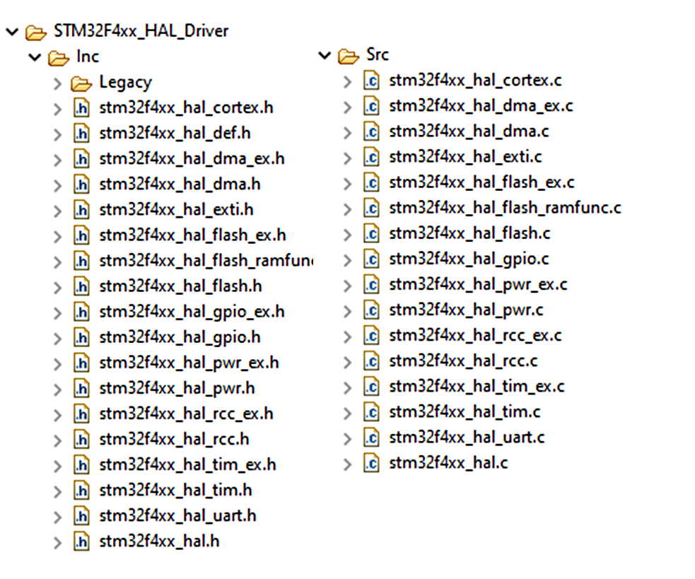
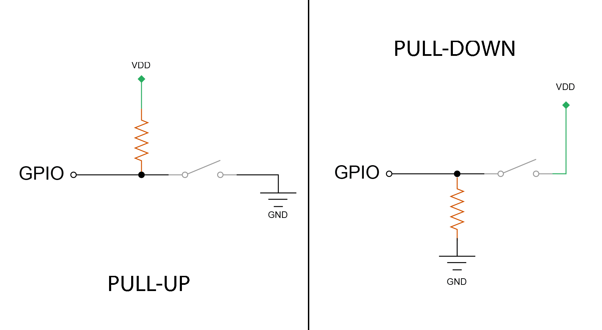
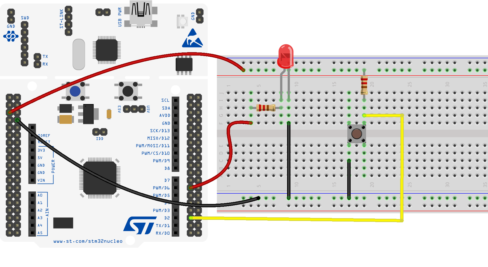

# Digital I/O e GPIO
Materials used in this exercise:
<div align="center">
    
|Material |   Number   |
|---------|------------|
| Application board| 1 |
| Breadboard       | 1 |
| Cables           | 6 |
| Buttons          | 1 |
| Led              | 1 |
| Resistors        | 2 |

</div>

## Overview
This lesson is mainly focused on the **GPIO** module. The ***G**eneral **P**urpose **I**nput/**O**utput* peripheral is an hardware interface used to allow the board to interact with the external environment.
This lesson shows how to configure and use this device by interacting directly with the registers associated with it (*low-level* approach). At the end of the lesson the students will have all the basic notions to create a simple application that uses pins, called also **GPIO** element, to read the status of different buttons and consequently change the logic level in output of other **GPIO** to perform various actions.
The user board manual will be our best friend in order to identify the correct [pins](https://github.com/FrancoTor95/Embedded-System-Programming/blob/master/HeadersPinout.md#header-pinout) to use in our application. 

## Bitwise operations

When we want to configure a specific register, it is often required to change one or more bits. This action can be easily made by means of exploiting the *bitwise* operations:
```
REG = 0x04;     // Set bit[2] and clear other bits
REG |= 0x04;    // Set bit[2] and keep others unchanged
REG &= 0x04;    // Clear all bits except bit[2]
REG &= ~0x04;   // Clear bit[2] and keep others unchanged
```
🎯 The operations that involve directly the bits, so called *bitwise*, let the programmer interact directly with the bits (instead of just bytes) that characterize a variable. In **C** they are defined by means of the following operators:

`&`     &nbsp;&nbsp;&nbsp;(Logical conjunction operator: *and*)</br>
`|`     &nbsp;&nbsp;&nbsp;(Logical disjunction  operator: *or*)</br>
`^`     &nbsp;&nbsp;&nbsp;(Exclusive disjunction operator: *xor*)</br>
`~`     &nbsp;&nbsp;&nbsp;(Ones' complement)</br>
`<<`    &nbsp;&nbsp;(Left Bit-Shift)</br>
`>>`    &nbsp;&nbsp;(Right Bit-Shift)</br>

To deeply master these operations, the programmer need to have a clear understaning of the binary number rappresentation inside our *MCU* (**M**icro**C**ontroller **U**nit).
When working with bits (as we will see later) it is often useful to express numbers with their hexadecimal representation:
</br>

|Binary| Dec | HEX |
|:---: |:---:|:---:|
| 0000 0001 | 1   | 0x01|
| 0000 0010 | 2   | 0x02|
| 0000 0100 | 4   | 0x04|
| 0000 1000 | 8   | 0x08|
| 0001 0000 | 16  | 0x10|
| 0010 0000 | 32  | 0x20|
| 0100 0000 | 64  | 0x40|
| 1000 0000 | 128 | 0x80|

In the following example *bitwise* operations are used in **C** to modify 8-bit variables:
```c
unsigned char val1, val2, res;
val1 = 21;         // 0001 0101
val2 = 0x7;        // 0000 0111
// AND    
res = val1 & val2; // 0000 0101
// OR
res = val1 | val2; // 0001 0111 
// XOR
res = val1 ^ val2; // 0001 0010
// Ones' Complement
res = ~val1;       // 1110 1010
// Shift 
res = val1<<2      // 0101 0100	
res = val1>>3      // 0000 0010
```

## GPIO and related registers
Like many other devices, the *STM32* microcontrollers also offer dedicated circuits that realize *General Purpose* (**GPIO**) *Input/Output* to interface the board with components external to the microcontroller. The signals that, through external pins, are fed to a **GPIO** are treated as digital signals, therefore they assume one of two logic states:
* **0 Logico** ▶️ *Low level* ⏩ **0V**
* **1 Logico** ▶️ *High level* ⏩ **3.3V/5V**

<p align="center">
    
</p>

Each **GPIO** line can be configured, via software, as an *output* - to generate a signal that can be used, for example, to power a LED - or as an *input* - with the possibility of receiving a signal, for example, from a button - according to different modes.

There are tree different modalities to configure an *output*:
* **open-drain** 
> There is a transistor (NMOS) connects to ground and nothing else;
* **open-drain** con **pull-up**
> There is transistor (NMOS) connects to ground, and a resistor connects to VDD for solving *floating* problem;
* **push-pull**
> There are a transistor (PMOS) connects to VDD, and a transistor (NMOS) connects to GND (only one is operated at a time).

The available configuration for *input* are listed below:

* **pull-up** o **pull-down**
> There is only a resistor: connected to VDD in **pull-up**, connected to GND in **pull-down**

* **pull-up** e **pull-down**
> There are one resistor connected to VDD and a resistor connected to GND (useful in rare cases).

Previous configurations can be also mixed in order to give birth to more complex interactions in accordance the programmer needs.

Additionally, many **GPIO** pins share other analog and/or digital functionalities. For this reason they are all *high-current-capable* and provide the possibility of being configured, through appropriate parameters, to manage noise and electromagnetic emission.

The **GPIO** connection takes place via the pins that the card offers externally and are organized in groups, which are called *ports*. To distinguish different ports (related to different peripherals) they are associated with a litteral label:

    GPIOx with x = A,B,C,D,E,F,G,H

with **A-H** used to label the ports. It is possible to identify the pin of the port adding it's digit identifier

    GPIOxy con y = 0,1,...,15;

or, in a more generic way

    Px_y con y = 0,1,...,15.
    
🎯 Notice that each port has exactly 16 pins.

A single **GPIO** pin can be configured as an input or output via specific registers, each associated with a specific port. All the necessary informations on how to identify and configure these registers can be found in the official documentation of the *MCU*:

*	<u>**GPIO** port mode register **(GPIOx_MODER)**</u>

    These bits are written by software to configure the I/O direction mode:

    * 00: General purpose Input (reset state)
    * 01: General purpose Output mode
    * 10: Alternate function mode
    * 11: Analog mode
    
* <u>**GPIO** port output type register **(GPIOx_TYPER)**</u>

    These bits are written by software to configure the output type of the I/O port:
    * 0: Output push-pull (reset state)
    * 1: Output open-drain
    
* <u>**GPIO** port output speed register  **(GPIOx_OSPEEDR)**</u>

    These bits are written by software to configure the I/O output speed:

    * 00: 2 Mhz (low speed)
    * 01: 25 Mhz (medium speed)
    * 10: 50 Mhz (fast speed)
    * 11: 100 Mhz (high speed)

* <u>**GPIO** port pull-up/pull-down register   **(GPIOx_PUPDR)**</u>

   These bits are written by software to configure the I/O pull-up or pull-down:

    * 00: No pull-up, pull-down
    * 01: Pull-up
    * 10: Pull-down
    * 11: Reserved

* <u>**GPIO** port input data register **(GPIOx_IDR)**</u>

    These bits are read-only and can be accessed in word mode only. They contain the input value of the corresponding I/O port

* <u>**GPIO** port output data register **(GPIOx_ODR)**</u>
    
    These bits can be read and written by software

* <u>**GPIO** port bit set/reset register **(GPIOx_BSRR)**</u>
    
    These bits are write-only and can be accessed in word, half-word or byte mode. A read to these bits returns the value 0x0000

* <u>**GPIO** port configuration lock register **(GPIOx_LCKR)**</u>

    This register is used to lock the configuration of the port bits when a correct write sequence is applied to bit 16 (LCKK). The value of bits [15:0] is used to lock the configuration of the GPIO. During the write sequence, the value of LCKR[15:0] must not change. When the LOCK sequence has been applied on a port bit, the value of this port bit can no longer be modified until the next reset.

* <u>**GPIO** alternate function low/high register **(GPIOx_AFRL)**/**(GPIOx_AFRH)**</u>
    
    These bits are written by software to configure alternate function I/Os


The structures and variables necessary to use the **GPIO** pins, which already take into account the memory addresses where the various registers are located, are implemented in the libraries of the **HAL** (**H**ardware **A**bstraction **L**ayer) driver already available in *STM32Cube*.

```c
typedef struct {
  volatile uint32_t MODER;    // Mode register
  volatile uint32_t OTYPER;   // Output type register
  volatile uint32_t OSPEEDR;  // Output speed register
  volatile uint32_t PUPDR;    // Pull-up/pull-down register
  volatile uint32_t IDR;      // Input data register
  volatile uint32_t ODR;      // Output data register
  volatile uint32_t BSRR;     // Bit set/reset register
  volatile uint32_t LCKR;     // Configuration lock register
  volatile uint32_t AFR[2];   // Alternate function registers
  volatile uint32_t BRR;      // Bit Reset register
  volatile uint32_t ASCR;     // Analog switch control register
} GPIO_TypeDef;

#define GPIOA ((GPIO_TypeDef *)  0x40000000UL)
```

To access a register associated to a specific **GPIO** peripheral something similar to the following **C** code can be used:
```c
GPIOA->MODER &= ~(0x01 << 4); // Clear bit 4 of the GPIOA MODER
```
For more detailed information about this topic please refer to the [Reference Manual](https://www.st.com/resource/en/reference_manual/dm00135183.pdf) or the [official *HAL* library description](https://www.st.com/resource/en/user_manual/dm00105879-description-of-stm32f4-hal-and-ll-drivers-stmicroelectronics.pdf), included by default in every *STM32Cube* project.
</br>

> 🎯 The STM32Cube **HAL** is an STM32 embedded software layer that ensures maximized portability across the STM32 portfolio, while the **LL** APIs (Application Programming Interfaces) make up a fast, light-weight, expert-oriented layer which is closer to the hardware than the **HAL**. **HAL** and **LL** APIs can be used simultaneously with a few restrictions.

By exploiting the **HAL** drivers it is possible to fully use an *STM32* MCU for the development of any application. Although the structure may seem a bit complex at a first look, by appropriately exploiting the library it is possible to appreciate its simplicity and the important abstraction capacity of the hardware. Furthermore, the entire library is integrated into the *STM32Cube* development environment and the code that uses it can be generated automatically thanks to *STM32CubeMX*.

The syntax used in the **HAL** library is standardized, it allows the easy and fast development of a software that actually is (partially) independent by the hardware used.

<p align="center">
    
</p>

The **HAL** driver are divided into two categories: a first one containing the generics API for all the STM32 MCUs and the other one including all the custumization related to a specific family of MCUs.

<p align="center">
    
</p>


## Lets get to work
To implement this exercise external components (buttons and LEDs) will be used. They will be suitably connected to **GPIOs** using a breadboard.
In this regard, pay attention to correctly estabilish the physical connection between the button and the **GPIO** on the board. If by any chance you see some smoke coming out of a component it is advisable to remove the power cable immediately and pray that everything is ok 🤞. Often it will be not ok. For this reason, always double check the connections before attaching the power cable to the breadboard.

<p align="center">
    
</p>

The buttos connected as *input* to the board will be used to pilot the *logical output signals* that turn on and off the LEDs. To accomplish this task, each button - connected to an *input* **GPIO** - is associated to a LED - connected to an *output* **GPIO**.

For the physical connection between each component on the board refer to the following diagram showing how to connect a single button and an LED.



By clicking the button, physically connected to the pin managed by the **GPIOA10** (**PA10**), the logic value of the **GPIOB10** (**PB10**) will change its status. The result could also be analized with an oscilloscope, before connecting the LED. 

The software is implemented in *STM32Cube* without necessarily exploiting the "code generation" functions; in the main function code you must first enable the clock signal on the **GPIOA** and **GPIOB** ports using the **RCC_AHB1ENR** register, to activate them.

```c
RCC->AHB1ENR |= 0x03;  // 0x03 == 0000 0011
```

>:dart: The physical bus on which the **GPIO** ports are connected is the *AHB* bus (*A*dvanced *H*ighPerformance *B*us), it is faster than the bus exploited by other peripherals (*APB*) allowing to access the memory in a single clock cycle. This choice was, in fact, adopted ad-hoc for CPU and I/O devices in order to let them access memory very quickly.

At this point, **GPIOA10** can be enabled as input by configuring it in *pull-up-mode* and **GPIOB10** as output, also in *pull-up-mode* and with output type *push-pull*.

```c
/** GPIO A Config **/
GPIOA->MODER  &= ~(0x03 << 20); // Clear GPIOA10
GPIOA->MODER |= (0x00 << 20);   // Set Input
/* Pull-Up Mode su pin di input */
GPIOA->PUPDR |= (0x01 << 20);   

/** GPIO B Config **/
GPIOB->MODER  &= ~(0x03 << 20); // Clear GPIOB10
GPIOB->MODER |= (0x01 << 20);   // Set Output
/* Push-Pull output & Pull-Up */
GPIOB->OTYPER &= ~(0x01 << 10);  
GPIOB->PUPDR &= ~(0x03 << 20);  // Clear GPIOB10
GPIOB->PUPDR |= (0x01 << 20);
```
It is worth noting that in order to clear (*clear*) two bits, for example the ones in positions 20 and 21 of a register, the following *bitwise* logic can be used:

```c
REG &=  ~(0x03 << 20);
```
The full source code of this exercise can be foud in the folder **digital_io_stm32** that contains the whole *STM32Cube* project.

:warning:
When working with buttons please pay attention to the *bouncing* fenomena.
> "When the switch is closed, the two contacts actually separate and reconnect, typically 10 to 100 times over a periode of about 1ms." ("The Art of electronics", Horowitz & Hill, Second edition, pag 506.)
***
</br> </br>

## Exercises

:pencil:
Write a **C** code that, working with an 8-bit variable (`unsigned char`), sets the 4th, 5th and 6th bits to the values 1, 0 and 1 respectively; leaving all the other bits to 0.

:pencil:
With the same logic used in the previous example, enable two other input pins on two **GPIOs** of the **B** port, connecting them to two other buttons, and two other output pins on **GPIO** of the port **A**, connecting two more LEDs. Logically connect each button (input) to an LED (output) and make sure that when each button is pressed, a different LED lights up. Test the operation of the entire program by  evaluating the changes in the registers through the debug interface. Pay attention to use the appropriate resistors for the connection of LEDs and buttons, as indicated.


:question:
What is the *speed* of a **GPIO** configured as an output? In which register is this information stored and what is the default configuration value?

:question:
What are the differences, from a practical point of view, when an output **GPIO** is configured as *push-pull* or *open-drain*? What registers are used to configure these modes?
