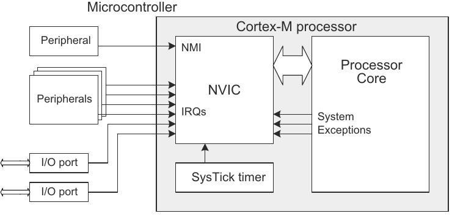
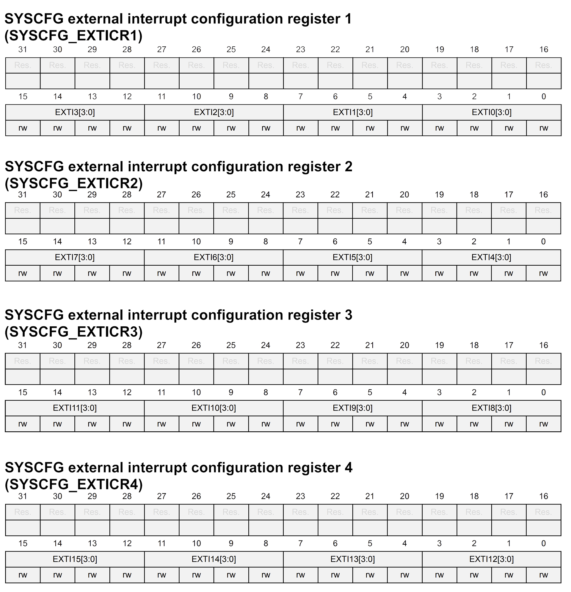
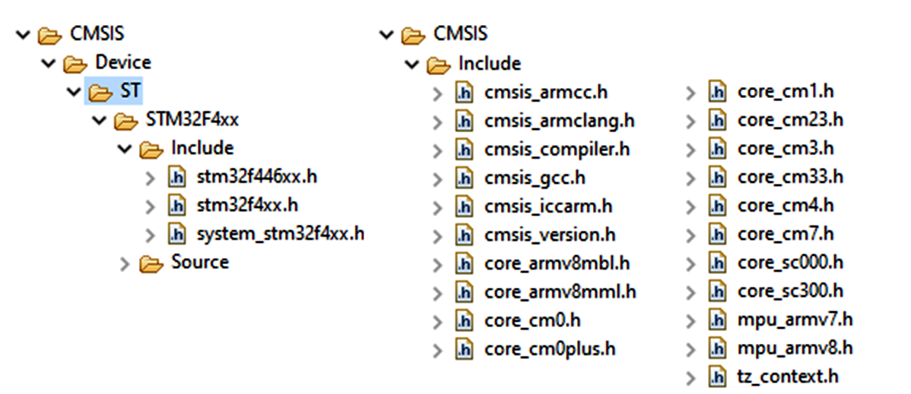
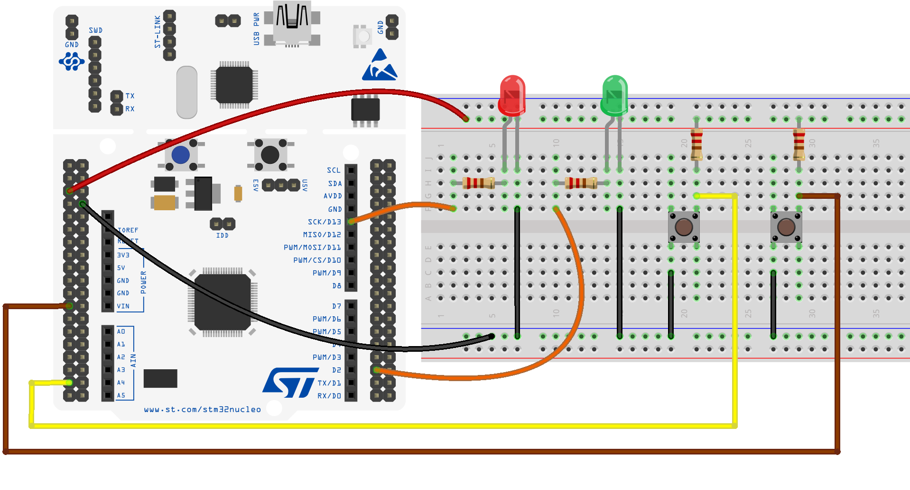
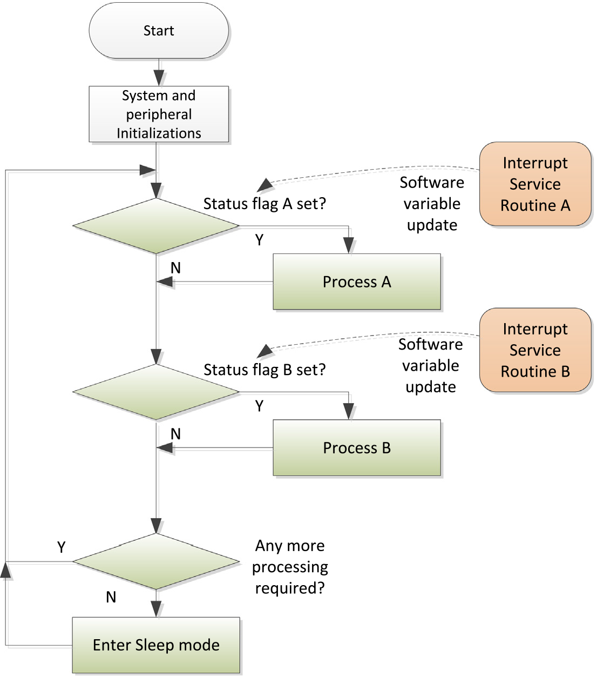

# GPIO ed Interrupt

</br>

## Overview
This documentation illustrates how to configure and use the *General Purpose Input Output* (**GPIO**) interface with a *Low-level* approach using the **interrupt** mechanism to manage external inputs, associated with pins enabled -obviously- as input.

The desired result is to have an application that notices the pressure on the buttons, connected to the input pins, thanks to external **interrupts**, avoiding *polling* operations. Consequently, the logical state of some **GPIO** outputs will be changed.

## Theoretical Aspects
When dealing directly with hardware, and not only working at the software level, it is important to know how to deal with **asynchronous** events, generally (but not always) originating from peripherals external to the computing unit .
For this reason, every microcontroller provides an interrupt mechanism (**interrupts**) to be able to manage asynchronous events; this mechanism allows to govern an essential interruption of the code in execution, in favor of particular functions that take the name of **I**nterrupt **S**ervice **R**outine (**ISR**), based on priority criteria.

These *routines* can be programmed to be invoked with respect to particular temporal events or at the occurrence of physical events, giving rise, in this case, to *event-driven* applications.
Inside a software for an *embedded system* , the **ISR** are coded as real functions, which however are not invoked anywhere, directly, in the code written by the programmer.

From the hardware point of view, the management of **interrupts** is mainly mediated by two modules:
* **N**ested **V**ectored **I**nterrupt **C**ontroller (**NVIC**)

  >The **NVIC** maintains knowledge of the stacked (nested) interrupts to enable tail-chaining of interrupts. The **NVIC** supports up to 240 dynamically reprioritizable interrupts each with up to 256 levels of priority. The **NVIC** and the processor core interface are closely coupled, which enables low latency interrupt processing and efficient processing of late arriving interrupts.</br></br>
  

* **EXT**ernal **I**nterrupt/event Controller (EXTI)

  >The external interrupt/event controller consists of up to 23 edge detectors for generating event/interrupt requests. Each input line can be independently configured to select the type of the interrupt and the corresponding trigger event (rising or falling or both). Each line can also masked independently. A pending register maintains the status line of the interrupt requests.


These entities (and consequently the **interrupts** mechanism) are managed based on the configuration of appropriate registers found in the microcontroller.

## Registers for interrupt management
*	SYSCFG external interrupt configuration register **(SYSCFG_EXTICRn)**, n:[1:4]

    These bits are written by software to select the source input for the **EXTIx** external interrupt.

    * 0000: PAx pin
    * 0001: PBx pin
    * 0010: PCx pin
    * 0011: PDx pin
    * 0100: PEx pin
    * 0101: PFx pin
    * 0110: PGx pin
    * 0111: PHx pin

<p align="center">
  
</p>

    
* Interrupt mask register **(EXTI_IMR)**
    
    Set the interrupt as maskable/non-maskable on line *x*
    
    * 0: Interrupt request from line *x* is masked
    * 1: Interrupt request from line *x* is not masked
    
    <br>

  >:dart:
  >All interrupt requests (IRQs) raised by external devices can result in interrupts, in general, *maskable* or *nonmaskable*. The former can, in turn, be: *masked* or *unmasked (not masked)*; a *masked* interrupt is ignored by the processor as long as it is in this state. Instead, a *nonmaskable* interrupt is always recognized and processed by the processor.

* Rising trigger selection register **(EXTI_RTSR)**

    Rising trigger event configuration bit of line *x*
    
    * 0: Rising trigger disabled for input line *x*
    * 1: Rising trigger enabled for input line *x*

* Falling trigger selection register **(EXTI_FTSR)**

    Falling trigger event configuration bit of line *x*
    
    * 0: Falling trigger disabled for input line *x*
    * 1: Falling trigger enabled for input line *x*

* Pending register **(EXTI_PR)**

    Pending bit on line *x*
    
    * 0: No trigger request occurred
    * 1: Selected trigger request occurred
    
    This bit is set when the selected edge event arrives on the external interrupt line. This bit is cleared by programming it to 1.
    
    
For more accurate information, please refer to [Reference Manual](https://www.st.com/resource/en/reference_manual/dm00135183.pdf).

## Implementation and other details
Refer to the documentation of the Nucleo-FXXXRE development board to identify its *pinout*, then the pins to be used to connect buttons and LEDs using a suitable breadboard, resistors and connectors, as already done previously.

### Interrupt handling funtions, **NVIC** and **EXTI Controller**
```c
__enable_irq();                       \\ Enable management of interrupt requests
NVIC_SetPriority(EXTI3_IRQn, 0);      \\ Priority assignment 
NVIC_EnableIRQ(EXTI3_IRQn);           \\ Enable the interrupt on the dedicated line
NVIC_DisableIRQ (EXTI3_IRQn);         \\ Disable the interrupt
NVIC_ClearPendingIRQ(EXTI3_IRQn);     \\ Cancel pending interrupt requests
```
The functions associated with the **interrupts** (the **I** nterrupt **S** ervice **R** outines) must have names that respect the nomenclature established by the **CMSIS-Core** and by the driver **HAL**, therefore for an **interrupt** associated with the **EXTI3** line, we will obtained the function
```c
void EXTI3_IRQHandler(void){
  NVIC_ClearPendingIRQ(EXTI3_IRQn);  \\ Clean IRQ register
  ext_flag = 1;                      \\ Value assignment to external variable
  EXTI->PR |= 0x01 << 3;                
}
```
Conventionally, we make sure that the processor spends as little time as possible processing an **ISR**, often we just change the value of some variables, or maybe we configure a value for some *flag*, checked somewhere else, outside the **ISR**, to enable the execution of specific computations or operations.

>:dart: The **C**ortex **M**icrocontroller **S**oftware **I**nterface **S**tandard (**CMSIS**) is a vendor-independent hardware abstraction layer for microcontrollers that are based on ARM® Cortex® processors. 

The **CMSIS-Core** is one of the central components of this library (**CMSIS**) developed by ARM, which allows you to manage in a very simplified way a series of peripherals inside the microcontroller, such as **NVIC** or registers for **MPU** (**M**emory **P**rotection **U**nit) and **FPU** (**F**loating **P**oint **U**nit).

For a *STM32Cube* project, the use of this library, together with the **HAL** driver, provides a superstructure that allows you to deal in a way that simplifies many peripherals that are otherwise complex to manage.

<p align="center">
  
</p>

## 

Through the **GPIO** inputs, 16 different lines are exported on which it is possible to connect **interrupts**; evidently, all pins of type **Px_y** will be on the **y** line. For example for a pin like **PA_0** you will find the associated **interrupt** on line **0** and a pin like **PC_13** on line **13**.

A **STM32F4** microcontroller has 7 different *handlers* to manage **interrupts** associated with the **GPIO** pins. For each interrupt request (**IRQ**), the associated **ISR** must have a specific name, as indicated in the following table.

|IRQ|Handler|	Description|
|:---------:|:--------------:|:-:|
|EXTI0_IRQn	|`EXTI0_IRQHandler`|Handler pins connected at line 0|
|EXTI1_IRQn	|`EXTI1_IRQHandler` |Handler pins connected at line 1|
|EXTI2_IRQn	|`EXTI2_IRQHandler` |Handler pins connected at line 2|
|EXTI3_IRQn	|`EXTI3_IRQHandler` |Handler pins connected at line 3|
|EXTI4_IRQn	|`EXTI4_IRQHandler` |Handler pins connected at line 4|
|EXTI9_5_IRQn	|`EXTI9_5_IRQHandler`	|Handler pins connected from line 5 to 9| 
|EXTI15_10_IRQn	|`EXTI15_10_IRQHandler`	|Handler pins connected from line 10 to 15|

🧐


Keep in mind that pins with the same number are *multiplexed* on a single line, so you have to pay attention to simultaneous use of pins with the same number or even to the use of pins that are on several lines but managed by a single **ISR**. <br>

For example: using **PA_6** and **PB_8** as inputs to detect external events, the **ISR** to be used will be `EXTI9_5_IRQHandler`, within this it is necessary to discern from which of the two pins actually the request for interruption has arisen.
## 
To proceed with the development of the desired application, as previously done, we need to enable the clock signal on the **GPIO** ports you want to use (**GPIOC** and **GPIOA**) using the **RCC_AHB1ENR register**, then enable **GPIOC2** and **GPIOC13** as inputs by configuring them in *pull-up mode* and **GPIOA5** and **GPIOA10** as outputs, in *pull-up mode* and type output in *push-pull*.

After enabling the **GPIO** peripheral, the *system configuration controller* (**SYSCFG**) must be enabled too; this controller is connected to the *APB* bus and is used to manage external interrupts related to the **GPIO** ports. After its enabling (using the **RCC_APB2ENR** register), its registers are configured to select the external interrupt lines to be enabled. For the development of the suggested exercise, an **interrupt** is associated to pin **13** of the **C** port and the **ISR** associated with it is written, which is invoked based on the pressure of the button connected on the **GPIOC13** and manages the status of the LED on **PA_5**. The same procedure is carried out for the pin **2** of the **C** port.

```c
// SYSCFG Abilitation
RCC->APB2ENR |= RCC_APB2ENR_SYSCFGEN;
// Activating External interrupt on GPIOC2
SYSCFG->EXTICR[0] |= SYSCFG_EXTICR1_EXTI2_PC;
// Activating External interrupt on GPIOC13
SYSCFG->EXTICR[3] |= SYSCFG_EXTICR4_EXTI13_PC;  
```

Note that we made use of constant values that are already defined within the **CMSIS** library, their definitions are given below:
```c
#define RCC_APB2ENR_SYSCFGEN      (0x1UL << 14U)  /*!<0x00004000 */
#define SYSCFG_EXTICR1_EXTI2_PC   0x0200U         /*!<PC[2] pin */
#define SYSCFG_EXTICR4_EXTI13_PC  0x0020U         /*!<PC[13] pin */
```
They are part of a series of numeric values that the library provides in order to facilitate the insertion of values into the registers and are defined in the `stm32f446xx.h` file, which contains this header:
>*CMSIS STM32F446xx Device Peripheral Access Layer Header File.*
>This file contains:
> * Data structures and the address mapping for all peripherals
> * Peripherals registers declarations and bits definition
> * Macros to access peripheral’s registers hardware

After the activation of the lines for the external interrupts of interest, the **EXTI** registers are used to configure them and subsequently it is possible to configure their priority and enable them through the functions of the **NVIC** module.
```c
EXTI->IMR |= (0x01 << 13) | (0x01 << 2);     // Set not masked interrupt
EXTI->RTSR |= (0x01 << 13) | (0x01 << 2);    // Rising Edge

// Interrupt Abilitation
__asm volatile ("cpsie i" : : : "memory");

// Gestione NVIC
NVIC_SetPriority(EXTI15_10_IRQn, 0);
NVIC_SetPriority(EXTI2_IRQn, 0);
NVIC_ClearPendingIRQ(EXTI15_10_IRQn);
NVIC_ClearPendingIRQ(EXTI2_IRQn);
NVIC_EnableIRQ(EXTI15_10_IRQn);
NVIC_EnableIRQ(EXTI2_IRQn);
```

In the main function, within the main life cycle of the program, it is not necessary to perform any operation: the management of the LEDs is carried out in the **ISR**, as follows:
```c
void EXTI2_IRQHandler(void){
  NVIC_ClearPendingIRQ(EXTI2_IRQn); // Clear pending IRQ
  GPIOA->ODR ^= (0x1 << 10); // Set Output on PA_10
  EXTI->PR |= (0x01 << 2);  // Clear the EXTI pending register
}
```

<br>

Below is the diagram showing the connection of the components (LEDs and buttons) with the development board.




Upon pressing the buttons, physically connected to pins **PC_13** and **PC_2**, an interrupt request arrives at the **NVIC**, which communicates with the processor and invokes the **ISR** associated with the identified event.

:warning:
* Avoid *blocking* code inside **ISR**: Don't invoke calls to functions such as `wait()`, potentially infinite loops, or other constructs that could be blocking.
* Avoid calling other functions, both simple ones like a `printf()`, and more elaborate ones like a `malloc()` or a different **ISR**. These functions could assume a behavior that is corrupt if invoked from inside an **ISR**.
* Beware of using debugging mechanisms, which may not work properly when working with **ISR** calls.


## 
The implementation shown uses the **interrupt** logic completely, without using *polling* (although this may sometimes be necessary). A more complete diagram is the one shown below, which also identifies the call to use the *sleep* mode of the microcontroller.


<p align="center">
  
</p>

According to this logic, a *flag* can be used in the **ISRs** and the value of this variable is checked within the main life cycle of the microcontroller to perform some operations. In this way, even more elaborate processes can be associated with each **interrupt** than a variable's value change.

If you want to develop the software according to this mechanism, you have to structure the entire code using **interrupts**, otherwise a mixed behavior (as below) could generate some functioning problems with respect to the desired behavior. And above all, you could not use *sleep* mechanisms for the microcontroller.


```c
volatile int flag = 0;

...

while (1){
  if(!(GPIOC->IDR >> 14 & 0x01)){ // Polling!!!
    GPIOA->ODR ^= (0x1 << 10);
    HAL_Delay(400);
  }

  if(flag){ // 'flag' control related to a interrupt
    GPIOA->ODR ^= (0x1 << 5); 
    HAL_Delay(400);
    flag = 0;
  }
}
```

***


:pushpin: <br>

It is possible to summarize, in the following points, the main operations to be performed in order to use the interrupt mechanism associated with **GPIOs**:
1. Enable the **GPIO** ports of interest, on which there are the pins to be used as input, through the **RCC** peripheral;
2. Enable the **SYSCFG** controller and activate the desired external interrupt lines;
3. Choose the event (rising / falling edge) for the single line, using the **RTSR** or **FTSR** registers;
4. Make the line *masked* by configuring the **IMR** register
5. Configure the priorities for the desired line, using the **NVIC** functions, exported from the **CMSIS** library;
6. Enable interrupts using the **NVIC** functions, exported from the **CMSIS** library;
7. Implement the **ISR** associated with all enabled lines.

***


</br></br>

## Exercises

:pencil:

Starting from the example presented, insert a third button (with a third **ISR**) and a third LED. At this point, with the *flag* mechanism, create a different function for the LEDs for each button pressed:
1. Status change (*toggle*) of all three LEDs;
2. Intermittent flashing of the three LEDs for at least one second;
3. Sequential switching on and off of the three LEDs.

Possibly, implement these two features in two separate methods, developed outside the `main()`.

:question: Which register is used for priority management of **interrupts**? How many (and which) fields is this register divided into for the priority configuration?

:question: Which registers are considered into the configuration of the *System Timer* (**SysTick**)?

<!--
:question: Is it possible, using the **HSI** clock with **PLL**, to generate a **SYSCLK** at 100.5 Mhz? Motivate the answer by explaining the solution, possibly also show a screen of the *Clock Configuration* screen of STM32Cube MX.
 -->
