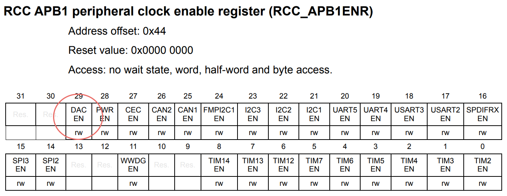

# ANALOG I/O

</br>

## Overview
In today lesson we will create different applications in order to show how the peripherals interfacing with analog signals work. This is an important topic, infact, every signal, when inside an MCU, must necessarily be understood as digital values that we want to performe algorithmic operations.

We will use *STM32Cube* and the **HAL** driver to perform Analog-Digital conversion operations that are slightly more complex, from an implementation point of view, if compared to simple digital I/O operations.

## Theoretical aspects

### Analog-to-Digital-Converter (ADC)
It is a device capable of converting an analog signal, continuous over time, into a series of discrete values. The output value is determined starting from the input voltage value, compared with a fixed reference voltage value, according to the formula

<p align="center">
    
</p>

The *resolution* in terms of voltage is determined from the *bit resolution* of the **ADC**, which defines the available quantization levels. On the Nucleo-F446RE MCU there is an **ADC** with _12-bit resolution_, therefore 4096 (= 2¹²) quantization levels, which correspond to 4096 possible distinguishable outputs. The reference voltage is equal to 3.3V, consequently the resolution in terms of voltage is 0.81mV (=3.3V/4096).


So, for example, if the input voltage is equal to 1V, the **ADC** will generate an output digital value equal to 1250 (1/0.00080) which is equivalent to the binary number **010011100010** (12-bit); while for an input voltage equal to 3V, the conversion to digital will produce the value 3750 (3/0.00080) which is equivalent to the binary value **111010100110**.

Note that the higher the resolution, the lower the number of possible conversions in the same time interval; in applications where "response speed" is not crucial, use the highest possible resolution.

### **D**igital-to-**A**nalog-**C**onverter (**DAC**)
It is a device that converts a digital signal into an analog one: it accepts as an input a finite precision value (generally expressed as a binary number) and outputs an analog voltage signal determined as follows on the basis of a reference voltage:

<p align="center">
    
</p>

Also for this device it is possible to determine a _resolution_ (in bits or in terms of voltage) as for an **ADC**. The concepts behind this peripheral are very similar to those analyzed so far.

### ADC/DAC and STM32

In the *STM32* devices, the conversion offered by the **ADC** is provided by a **SAR** (**S**uccessive **A**pproximation **R**egister) structure and can operate in different modalities: *single mode*, *continuous mode*, *scan mode*.

These modalities, and the entire structure, can be used according to three main logics, identified as:
- *polling mode*
- *interrupt mode*
- *DMA mode*

The results obtained are always stored in a 16-bit register whose bits inside may be aligned to the left (*left-aligned*) or to the right (*right-aligned*).

It should also be noted that, generally, the **ADC** implements particular functions to start the conversion of analog values based on the recognition of particular voltage values used as thresholds, defined by the programmer.

The microcontroller used in this tutorial provides a 12-bit **ADC**, which communicate with the outside via 16 different channels. 

<p align="center">
    
</p>

For what concern the **DAC**, the microcontroller has a 12-bit **DAC** (if more are available, they can also be used simultaneously). In addition to this, other main features are: the possibility to use 8, 10 or 12 bits; the possibility to exploit external *triggers* and the possibility of management via **DMA**.

## Registers related to ADC and DAC

Like other peripherals, **ADC** and **DAC** are also managed by appropriately configuring registers, or otherwise using structures and functions exported from the **HAL** driver. The complete management through the latter hides to the programmer a whole series of configurations that are generally necessary for the use of an **ADC** or a **DAC**, starting from the choice of the system clock and then continue with:
* Enable clock on peripheral (**ADC/DAC**)
* Enabling the clock and enabling the **GPIO** that you want to use to externalize the peripheral
* Configuration of the acquisition/generation speed by setting appropriate prescalars of the system clock
* Other aspects related to resolution configuration, any external trigger, use of *DMA*, etc;

The clock configuration for the **ADC** device is done through the `APB2ENR` register of RCC while the **DAC** instead is attached to` APB1ENR`.

<p align="center">
    
    
</p>

Below it is reported some of the main registers used to configure and utilize both **DAC** and **ADC**. For more information please refer to the [Reference Manual](https://www.st.com/resource/en/reference_manual/dm00135183-stm32f446xx-advanced-arm-based-32-bit-mcus-stmicroelectronics.pdf).

* **DAC** control register (**DAC_CR**)

    Configuring this register allows to enable/disable DAC channels, set output type, enable DMA support and more.

* **DAC** software trigger register (**DAC_SWTRIGR**)
  
    The bits in this register allows to enable/disable the software trigger for the two channels.
    
   * 0: Software trigger disabled
   * 1: Software trigger enabled
    
* **DAC** channel 1/2 8/12-bit right-aligned data holding register
(**DAC_DHRxRy**), *x = 8,12; y = 1,2*
    
    These bits are written by software which specify *x*-bit data for DAC channel *y*.

* **DAC** channel 1/2 8/12-bit left-aligned data holding register
(**DAC_DHRxLy**), *x = 8,12; y = 1,2*

     These bits are written by software which specify *x*-bit data for DAC channel *y*.

* **ADC** control register x (**ADC_CRx**), *x = 1,2;*

    Configuring this register allows to enable/disable ADC channels, set resolution, set continuous/discontinuous mode, configure scan mode, set data alignment and more.

* **ADC** regular sequence register *x* (**ADC_SQRx**), *x = 1,2,3;*

    These bits are written by software to define the total number of conversions in the regular channel conversion sequence and manage the channels.

* **ADC** regular data register (**ADC_DR**)

    These bits are read-only. They contain the conversion result from the regular channels. The data are left- or right-aligned.


## Analog I/O and STM32Cube
### DAC use case

Probably the simplest application to test the operation of a **DAC** is to generate analog signals at a fixed voltage. To implement this application, the previously illustrated registers are used, also initializing the pin to be used for the analogue output: on the board used, one of the two pins capable of carrying out this purpose is pin 4 of port A (**PA_4**).

The main program executes, in its infinite life cycle, the commands to bring to the output a voltage value that varies from 0V to 3.3V, with 5ms of delay between different values. Obviously, to evaluate the correct functioning of the **DAC** it is necessary to connect the pin **PA_4** to an oscilloscope.
 
```c
int main{
    /* MCU Configuration--------------------------------------------------------*/

    /* Reset of all peripherals, Initializes the Flash interface and the Systick. */
    HAL_Init();

    /* Configure the system clock */
    SystemClock_Config();

    uint32_t dac_value;

    // Abilitazione GPIOA (bit 0)
    RCC->AHB1ENR |= RCC_AHB1ENR_GPIOAEN;

    // GPIOA4 : Analog mode
    GPIOA->MODER &= ~(0x03 << 8);
    GPIOA->MODER |= 0x00000300; // Set pin 4 in Analog Mode

    // Abilitazione DAC (bit 29 di APB1ENR)
    RCC->APB1ENR |= RCC_APB1ENR_DACEN;

    // Configurazione DAC tramite control register
    DAC->CR |= (0x01 << 0); // enable DAC channel 1
    DAC->CR |= (0x00 << 1); // enable DAC ch1 output buffer
    DAC->CR |= (0x01 << 2); // enable Trigger
    DAC->CR |= (0x07 << 3); // choose Software Trigger as source (0b111)

    // set output to Vref * (dac_value/0xFFF)
    DAC->DHR12R1 = dac_value;
    DAC->SWTRIGR |= (0x01 << 0); // trigger ch1

    while(1){
        for(dac_value = 0x00; dac_value < 0xFFF; dac_value += 0x010) {
            DAC->DHR12R1 = dac_value;
            DAC->SWTRIGR |= (1 << 0 ); // trigger ch1
            HAL_Delay(5);
        }
    }


}
```
This application generates a *sawtooth* wave, with a period of 50ms and a delay of 5ms between each step. The output of the **DAC** should be evaluated with an oscilloscope; the analysis should return a graph like this:

<p align="center">
    
</p>

### ADC use case

The **ADC** can be used by connecting external analog peripherals, such as potentiometers or analog sensors. Following these simple steps it is possible to develop simple applications able to acquire and process analog signals.

Below is an example of acquiring a rotary potentiometer, connected to the board as shown in the following image; the potentiometer output is connected to the analog input on pin 0 of port A (**PA_0**).

<p align="center">
    
</p>

The connection respects the basic logic according to which all rotary potentiometers work.

<p align="center">
    
</p>

In this case the registers indicated above are used to structure, in the `main()`, a code that acquires the values obtained by the potentiometer that can also be read using the debug interface of the development environment.

```c
int main(void){
    /* MCU Configuration--------------------------------------------------------*/

    /* Reset of all peripherals, Initializes the Flash interface and the Systick. */
    HAL_Init();

    /* Configure the system clock */
    SystemClock_Config();

    /* Configure GPIOA1 in Analog mode */
  	RCC->AHB1ENR |= RCC_AHB1ENR_GPIOAEN;
    GPIOA->MODER &= ~(0x03 << 2);
  	GPIOA->MODER |= (0x03 << 2); //PA_1 :: Analog

    /* Configure ADC1 */
  	RCC->APB2ENR |= RCC_APB2ENR_ADC1EN; // Enable Clock
  	ADC1->CR2 |= (0x03); //ADON = 1 & CONT = 1
  	ADC1->CR1 &= ~(0x03 << 24); //RES = 00 12 bit resolution
  	ADC1->CR2 &= ~(0x01 << 11); //ALIGN = 0, right aligned data
  	ADC1->SMPR2 &= ~(0x07 << 3); //SMP1 = 000 3 cycle sampling
  	ADC1->SQR3 &= ~(0x1F); // Clear SQR3
  	ADC1->SQR3 |= 0x01; // 1st conversion in regular sequence

    /* Infinite loop */
    /* USER CODE BEGIN WHILE */
    while (1){
        /* USER CODE END WHILE */

        /* USER CODE BEGIN 3 */
        ADC1->CR2 |= 0x40000000; // Start conversion
        
        /* Wait conversion completed */
        while(!(ADC1->SR & 2)){
            __NOP();
        } 
        
        uint32_t raw_data = ADC1->DR; // Get Data
    }  
    /* USER CODE END 3 */
}
```

### HAL programming
To configure the **ADC** peripheral, in *STM32Cube*, you can use, according to a higher level approach, the **HAL** driver; This library includes a number of very specific functions and data structures, including the following:

```c
typedef struct {
    ADC_TypeDef         *Instance; // Pointer to ADC descriptor
    ADC_InitTypeDef     Init;      // ADC initialization parameters
    __IO uint32_t       NbrOfCurrentConversionRank; // ADC number of current conversion rank
    DMA_HandleTypeDef   *DMA_Handle;  // Pointer to the DMA Handler
    HAL_LockTypeDef     Lock;         // ADC locking object
    __IO uint32_t       State;        // ADC communication state
    __IO uint32_t       ErrorCode;    // Error code
} ADC_HandleTypeDef;
```

in which:
- `Instance`: is the pointer to the **ADC** descriptor we are going to use, for example `ADC1`is the descriptor of the first ADC peripheral:
- `Init`: is an instance of the C struct `ADC_InitTypeDef`, which is used to configure the **ADC**;
- `NbrOfCurrentConversionRank`: corresponds to the current i-th channel (rank) currently in use;
- `DMA_Handle`: is a pointer used for handling the **ADC** in *DMA mode*.

For the configuration of the **ADC** another structure, reported below, is used:

```c
typedef struct {
    uint32_t ClockPrescaler; // Selects the ADC clock frequency
    uint32_t Resolution; // Configures the ADC resolution mode
    uint32_t ScanConvMode; // The scan sequence direction.
    uint32_t ContinuousConvMode; // Specifies whether the conversion is performed in Continuous or Single mode
    uint32_t DataAlign; // Specifies whether the ADC data alignment is left or right
    uint32_t NbrOfConversion; // Specifies the number of input that will be converted within the regular group sequencer
    uint32_t NbrOfDiscConversion; // Specifies the number of discontinuous conversions in which the main sequence of regular group
    uint32_t DiscontinuousConvMode; // Specifies whether the conversion sequence of regular group is performed in Complete-sequence/Discontinuous sequence
    uint32_t ExternalTrigConv; // Select the external event used to trigger the start of conversion
    uint32_t ExternalTrigConvEdge; // Select the external trigger edge and enable it
    uint32_t DMAContinuousRequests; // Specifies whether the DMA requests are performed in one shot or in continuous mode
    uint32_t EOCSelection; // Specifies what EOC (End Of Conversion) flag is used for conversion polling and interruption
} ADC_InitTypeDef;
```

Even if it is full of fields, the fundamental ones are:
- `ClockPrescaler`: defines the clock speed for the analog circuit that is part of the **ADC** (**ADCCLK**). The clock is also generated using a *prescalar*, which allows the **ADC** to work at **fPLCK/2,/4,/6,/8**.
- `Resolution`: allows the choice of the **ADC** resolution, the possible values are generally:`ADC_RESOLUTION_12B`, `ADC_RESOLUTION_10B`,`ADC_RESOLUTION_8B` and `ADC_RESOLUTION_6B`; which obviously represent the possible resolutions in terms of bits, from 12 to 6.
- `ScanConvMode` and` ContinuousConvMode`: allow you to manage the different conversion modes such as *scan mode*, *single mode* and *continuous mode*.
- `NbrOfConversion`: specifies the number of channels to use in *scan mode*.
- `DataAlign`: it is used to perform an alignment of the stored bits following the conversion; can take the values `ADC_DATAALIGN_LEFT` or`ADC_DATAALIGN_RIGHT`.
- `ExternalTrigConvEdge`: used to select the external source on which to start a conversion.

Known the different possible conversion methods and their operation, it is possible to analyze the structure that manages the channel configuration and subsequently implement methods for using the **ADC**, both in *polling* and in *interrupt mode*.

```c
typedef struct {
    uint32_t Channel; // Specifies the channel to configure into ADC rank
    uint32_t Rank;    // Specifies the rank ID
    uint32_t SamplingTime; // Sampling time value for the selected channel
    uint32_t Offset; // Reserved for future use, can be set to 0
} ADC_ChannelConfTypeDef;
```

in this structure:
- `Channel`: can take values from` ADC_CHANNEL_0` to `ADC_CHANNEL_N`, with *N* indicating the number of channels available.
- `Rank`: can assume values from 0 to 16 and corresponds to the *ranks* associated with the channel.
- `SamplingTime`: the value to be inserted in this field is often chosen among a set of possible values that the development environment itself proposes, as they are specific values of the *MCU* used.

For more detailed information on data structures and methods exported by the **HAL** driver for managing the **ADC**, please refer to the [official documentation](https://www.st.com/resource/en/user_manual/dm00105879-description-of-stm32f4-hal-and-ll-drivers-stmicroelectronics.pdf).

Two different implementation logics will be used below to read the temperature supplied by an analog temperature sensor.

#### Polling Mode
In this exercise we will use the **ADC** in *polling* mode. First thing first, we will use the structures presented before and some functions such as `HAL_ADC_Start()`, `HAL_ADC_Stop()` and the following

```c
HAL_StatusTypeDef HAL_ADC_PollForConversion(ADC_HandleTypeDef* hadc, uint32_t Timeout);
```
to determine when the A/D conversion is complete and the result is available inside the ADC data
register. The function accepts the pointer to the `ADC_Handle` descriptor and a Timeout value, which
represents the maximum time expressed in milliseconds we are willing to wait. Alternatively, we
can pass the `HAL_MAX_DELAY` to wait indefinitely.

Once the conversion is finished, the converted value can be taken using the method:
```c
uint32_t HAL_ADC_GetValue(ADC_HandleTypeDef* hadc);
```
To configure the **ADC** we will use the tools provided by *STM32CubeMX*, configuring channel 0 of the **ADC** as shown in the figure:


With the help of this development environment, the code needed to configure the `ADC_HandleTypeDef` structure is automatically generated. However, it is important to understand both the set configuration and the related generated code.

In addition to the prescaling of the clock and the resolution set to maximum, the *scan mode* is disabled and the continuous conversion mode -*continuos mode*- is enabled so that the conversion takes place continuously, without rising interrupts, so that the *polling* mechanism can be easly practced. Also for this reason it is important to configure the *EOC* flag on `ADC_EOC_SEQ_CONV`.

These configurations will be found in the `void MX_ADC1_Init (void)` method, created as follows:
```c
hadc1.Instance = ADC1;
hadc1.Init.ClockPrescaler = ADC_CLOCK_SYNC_PCLK_DIV4;
hadc1.Init.Resolution = ADC_RESOLUTION_12B;
hadc1.Init.ScanConvMode = DISABLE;
hadc1.Init.ContinuousConvMode = ENABLE;
hadc1.Init.DiscontinuousConvMode = DISABLE;
hadc1.Init.ExternalTrigConvEdge = ADC_EXTERNALTRIGCONVEDGE_NONE;
hadc1.Init.ExternalTrigConv = ADC_SOFTWARE_START;
hadc1.Init.DataAlign = ADC_DATAALIGN_RIGHT;
hadc1.Init.NbrOfConversion = 1;
hadc1.Init.DMAContinuousRequests = DISABLE;
hadc1.Init.EOCSelection = ADC_EOC_SEQ_CONV;
```

After this first configuration it is possible to connect the temperature sensor and implement the code in the main life cycle of the program, which takes care of invoking the functions necessary to command a conversion to the **ADC** and take the converted digital values. These can be evaluated, for now, using the *debug* interface.

#### Interrupt Mode
From a logical point of view, the conversion to *interrupt mode* is not very different from the one just shown. However, the whole logic with which the software is designed changes, in fact in this case the **ISR** specifications are used to control the conversion of the **ADC** and *polling* processes will be avoided.

As for other peripherals managed by the **HAL** driver, we will make use of the functions that manage **interrupt** requests, in this case taking care not to change the name of the **ISR** associated with the **ADC**, as reported in the **HAL** libraries: `ADC_IRQHandler`.

Among the main functions to manage the **ISR** there are:

```c
HAL_ADC_IRQHandler();
```
```c
HAL_ADC_ConvCpltCallback();
```

the first handles **interrupt** requests, the second is automatically invoked when a conversion ends.

In addition to these two functions, we will use also

```c
HAL_ADC_Start_IT()
```

which enables the **ADC** to run in *interrupt mode*, starting the conversion process.

With this logic, the `main ()` could get a lot simpler and become, for example, similar to the following:

```c
int main(void) {
    HAL_Init();

    MX_ADC1_Init(); // ADC Initialization

    /* ADC Interrupt Configuration */
    NVIC_SetPriority(ADC_IRQn, 0);
    NVIC_EnableIRQ(ADC_IRQn);
    HAL_ADC_Start_IT(&hadc1);
    
    while (1){
        ;
    }
}
```

The management of the values converted by the **ADC** is done within the `HAL_ADC_ConvCpltCallback ()` method, which is invoked automatically and must be implemented by taking as argument the pointer to an `ADC_HandleTypeDef` structure which contains the configuration information of the specific **ADC** you are using.

As for the configurations of the main structures, we will use, as previously done, the *STM32CubeMX*, which will automatically generate the code following a graphical configuration phase.

##

In order to use the **ADC** in interrupt mode and also be able to execute code that is within the main program life cycle (the `while (1)`) you may need to adopt the following solution:
disable the continuous conversion mode, then:

```c
hadc1.Init.ContinuousConvMode = DISABLE;
```
in the `MX_ADC1_Init ()` function; manually command the restart of the **ADC** following each conversion, thus rewriting the **ISR** in this way:

```c
void ADC_IRQHandler(void) {
	HAL_ADC_IRQHandler(&hadc1);
    HAL_ADC_Start_IT(&hadc1);
}
```

Note that the `HAL_ADC_Start_IT (& hadc1);` function is re-invoked, which is also found in the `main` before the infinite loop, since in *non-continuous mode*, the **ADC** stops automatically after each conversion.
***

#### :traffic_light: 
An analog input can be used to read the values supplied by an analog sensor. A *Texas Instrument*: [LMT84](docs/lmt84.pdf) temperature sensor is chosen as a reference. All information regarding the connection with the board and the transformation of the voltage signal read into a temperature value can be found by consulting the sensor datasheet.

<p align="center">
    
</p>

The program executes an infinite loop within which it reads the value supplied by the **ADC**; the returned value (of type *floating-point* and which ranges between 0.0 and 1.0) is transformed into a voltage value in *mV* by multiplying it by 3300 (which corresponds to the reference voltage of the **ADC**: 3.3V = 3300mV). In order to convert between the signal into *mV* temperature value, a transformation formula is obtained starting from the one reported on the datasheet:

<p align="center">
    
</p>

<p align="center">
    
</p>


```c
int main(){
    
    ...

    while (1) {
        // Polling mode
        HAL_ADC_PollForConversion(&hadc1, HAL_MAX_DELAY);
        // Read the analog input value
        raw_in = HAL_ADC_GetValue(&hadc1);
        // Converts value in the 0V-3.3V range
        temp_mv = ((float)raw_in) / 4095 * 3300;
        // Convert mV to temperature
        temp = (1035 - temp_mv)/5.50f;
    }
}
```

</br> </br>

## Exercises

:pencil: Use a potentiometer to manage the flashing of an LED.

Using the values read by the potentiometer, the *flashing rate* of the LED must vary between 0 seconds and 1 second, in the case of a value equal to 0.0 the LED must switch off. The system is managed by pressing a button (**USER_BUTTON** or external button) which enables/disables the use of the value read by the potentiometer to manage the flashing of the LED: after starting the program, pressing the button disables the reading from the potentiometer and the LED continues to flash with a *rate* equal to the last value read in input; re-pressing the button restores the initial operation, with the potentiometer it is possible to manage the flashing of the LED again.

Implement the application in *STM32Cube*, using the **HAL** driver to manage the **ADC** that reads from the potentiometer.

:pencil: Exploit **ADC** e **DAC** to simulate the management of a very simplified temperature monitoring system.

The program reads, even in *polling*, the temperature value supplied by an analog sensor and cyclically checks if the read value exceeds a certain threshold (chosen in an appropriate manner given the application); if the threshold is exceeded, the reading phase is interrupted to pass to a phase of generation of a constant analogue signal (equal to 1.5V) for 10 seconds, during which a red signaling LED can light up.

To check the correct generation of the signal it is possible to use another analog input, on which the output of the **DAC** is connected. After 10 seconds, the program starts reading and checking the temperature value as it did initially. It is assumed that within 10 seconds the temperature is no longer above the threshold: it is left to the imagination to imagine some stratagem that, within those 10 seconds, cools the sensor. Finally, to make the exercise more complete, a modulation of the analog signal generated by a potentiometer could be added.

Note that, of course, this is only meant to be an exercise in order to get used to with the analog sensors, the **ADC** and the **DAC** outputs, it does not claim to be a true system of temperature monitoring and management.

</br>


:question: If for a 7-bit **DAC** the reference voltage is 2.56V, what is its resolution in terms of voltage?

:interrobang: Briefly describe the operation of a successive approximation **ADC** (*SAR*).

:question: How does the *Analog Watchdog* work and in which register are the configuration fields located? Such as the *analog watchdog channel selection* field.

##
</br></br></br>
:round_pushpin: For those who do not have a temperature sensor such as LMT84, LM35 or similar, it is possible to use of a *thermistor* NTC (for example the one included in the kit of components recommended for the exercise).

The *thermistors* are particular resistors that vary their resistance according to the temperature to which they are subjected. Those of the NTC type lower their resistance as the temperature increases, while the PTC ones increase it.

Unfortunately, these components do not have a totally linear characteristic, so a simple proportion is not enough to know their temperature (starting from the resistance), but it is necessary to have some parameters and use some specific equations.

For a classic MF52 type NTC *thermistor* (generally used in simple Arduino examples) the [datasheet](docs/mf52.pdf) is reported in the docs subfolder; in this document we find the main values to be used in the following formula (derived from reformulations and adaptations of the *Steinhart-Hart* formula):

<p align="center">
    
</p>

In this formula, in addition to the specific parameters of the *thermistor*, also reported below, the value of the resistance put in series with the *thermistor* must be used, preferably chosen from 10KΩ; this is in fact used together in the voltage divider formula to calculate the resistance value of the thermistor, starting from the **ADC** measurements. In this case, in fact, there is no link between temperature and voltage, but between temperature and resistance.

The variables to use are:
```c
#define R_S 10000    // Resistance in series to the thermistor
#define R25 10000    // Reference resistance
#define T0 25+273.15 // Reference temperature
#define B 3950       // B parameter of the thermistor
```
and to extract the temperature you can then use the logic illustrated in the following code:
```c
int main(){
    
    float meas_in;
    double v_in;
    float temp;
    float R_thermistor;
    float S_H;

    while(1) {
        // Read the analog input value (value from 0.0 to 1.0 = full ADC conversion range)
        meas_in = read_from_ADC();
        // Converts value in the 0V-3.3V range (3.3V = 3300mV)
        v_in = (meas_in*3300);
        // Calculate Thermistor Resistance (using Voltage divider formula)
        R_thermistor = (R_S)/((3300/v_in)-1);
        // Steinhart-Hart
        S_H = 1.0/(T0) + (1.0/B)*log(R_thermistor/R25);
        S_H = 1/S_H;
        // Kelvin -> Celsius
        temp = S_H-273.15;
        // Pause
        HAL_Delay(1000);
    }
}
```
The circuit to be used to integrate a *thermistor* NTC is the one shown below; note that the 10KΩ resistor and the thermistor are connected in *series*.

<p align="center">
 
</p>
