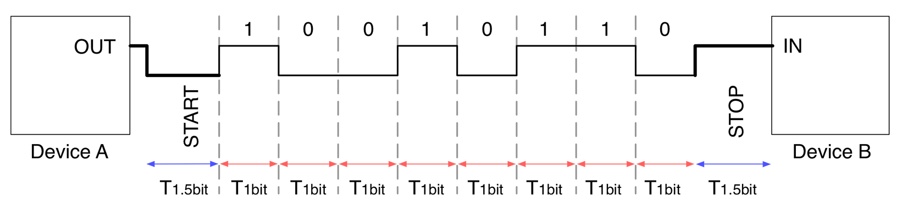
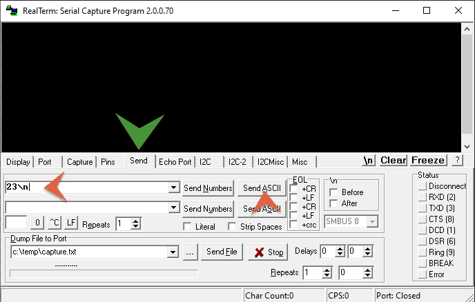

# Serial Communication (UART/USART)

</br>

## Overview
In the following it is reported a summary of this lecture involving serial communication interfaces like **UART**, **I²C** and **SPI**. This interfaces are used plenty for communicating with various devices and sensors.

- [Serial Communication](#comunicazione-seriale)
  - [Overview](#overview)
  - [Theoretical Requirements](#requisiti-teorici)
  - [UART e USART](#uart-e-usart)
    - [UART/USART in STM32 MCU](#uartusart-nei-microcontrollori-stm32)
 <!--
  - [I2C](#i2c)
    - [I2C nei microcontrollori STM32](#i2c-nei-microcontrollori-stm32)
  - [SPI](#spi)
    - [SPI nei microcontrollori STM32](#spi-nei-microcontrollori-stm32)
  - [Comunicazione USART in STM32Cube](#comunicazione-usart-in-stm32cube)
    - [Invio dati acquisiti da ADC via UART](#invio-dati-acquisiti-da-adc-via-uart)
    - [UART in modalità interrupt](#uart-in-modalità-interrupt)
    - [Ricezione UART con DMA](#ricezione-uart-con-dma)
  - [Comunicazione I2C in STM32Cube](#comunicazione-i2c-in-stm32cube)
  - [Comunicazione SPI in STM32Cube](#comunicazione-spi-in-stm32cube)
-->
  - [Exercises](#esercizi)

In this lecture the main focus will be put on **UART** and **USART** interfaces keeping the last two for the next lesson. 


## Theoretical Requirements
A serial communication efficiently uses just a single wire to transfer data, in term of bits, in a sequential manner.

Different serial communications establish different protocols to solve major problems related to communication between two devices. The first that can come to mind is, for example, to establish, on the receiver side, when a single bit or an entire sequence of data begins and ends.

An approach used by different protocols consists in using a *clock signal* "coupled" to the data, in this way it is possible to establish a synchronization between data and clock. A protocol that exploits a clock signal is called **synchronous**: for each pulse of the *clock signal* the transmitter sends a bit and the receiver synchronizes itself in accordance to one of the edges of the *clock signal* to carry out the reading. For example read the trasmitted data on every falling edge.


The frequency of the *clock signal* determines how fast the data is transferred and how long the entire transmission lasts.

In case both devices, which want to communicate, already agree on the speed and transmission time of a single bit, then the *clock signal* is no longer needed and the communication can take place in accordance to the agreed rules. In this case the communication is called **asynchronous**.



Different devices can be interconnected in different ways in order to realize serial communications. For example, it is also possible to create a "network" of devices with the classic *master-slave* architecture; in this case the device that manages the clock takes the role of master. Well known communication protocols that make wide use of this logic (as we will see in the next lecture) are the **SPI** and **I2C** protocols.

<p align="center">
     
</p>

## UART e USART

Although the **synchronous** serial communication is used with many devices, the management of a signal (*the clock*) that needs both a dedicated line and a certain available bandwidth turns out to be difficoult to manage in some cases. For this reason the research focused itself also on the development of **asynchronous** communication criteria. These also offer the advantage of being reliable over long distances, where a *clock signal* could degrade and cause you to lose synchronization.

The logic behind this type of communication is based on establishing the transmission duration of a single bit and avoiding the use of a synchronization clock. This mechanism is accomplished through a dedicated hardware device called **UART** (**U**niversal **A**synchronous **R**eceiver - **T**ransmitter), which is present in every microcontroller and allows communication with a myriad of devices.

In the simplest form, a **UART** communication uses only one connection for transmission (labeld as **TX**) and only one for reception (label as **RX**). It is important to establish the *data rate* with which the transmitter and receiver operate. This value is known in litterature and in practical environment as *baud rate*.

In addition to this value there are also other parameters that come into play when you want to send a data stream with **UART** communication. The main ones are the following:
- **Data bits**: Number of bits for single value transmitted (default: 8);
- **Stop bits**: Number of bits used to identify the end, the stop, of the data flow (default: 1);
- **Parity bit**: Presence and possible type of parity bit.

> :dart: 
A parity bit, or check bit, is a bit added to a string of binary code. Parity bits are a simple form of error detecting code. Parity bits are generally applied to the smallest units of a communication protocol, typically 8-bit octets (bytes), although they can also be applied separately to an entire message string of bits.

For the management of the **UART** in a microcontroller other important configuration parameters come into play, which also allow to put into practice different operating modes.

Often, this communication method is also accompanied by a clock signal, resulting in a (if necessary) synchronous protocol called **USART** (**U**niversal **S**ynchronous/**A**synchronous **R**eceiver-**T**ransmitter).

<p align="center">
     
</p>

While for **UART** communication a clock signal is generated internally in the microcontroller - starting from the knowledge of the *baud rate* and as soon as the first bit of the data stream is identified - for the **USART** communication there is no need to specify any *baud rate*. The clock signal travels on a dedicated channel and this allows even better results to be obtained. In some cases the data transfer *rate* can reach 4 Mbps. However, this implementation brings with it the disadvantages related to the presence of a clock signal.

### UART/USART in STM32 microcontrollers
Each microcontroller of the STM32 family exports at least one **UART** communication port. In the case of the microcontroller used for these exercises (F411RE) the devices embed three **UARTs** (UART3, UART4 and UART5)  and three universal synchronous/asynchronous receiver transmitters **USART** 
(USART1, USART2 and USART6).

The management of this type of communication obviously involves the use of appropriate registers that allow you to configure both a **USART** communication and **UART** communication, depending on the fields used. In the following, and also in the implementation phase, the two words will often be used in an equivalent way, specifying the distinction between the two only if necessary.

As for the configuration of the *baud rate*, we obviously use the system clock. As we will see it has to be suitably scaled in order to be adequate, on the **UART** peripheral, with the desired trasmission *rate*.

<p align="center">
    
</p>

The values that allow you to define the *baud rate* and other configuration parameters are all located into a set of registers, which are extensively described into the [reference manual](https://www.st.com/resource/en/reference_manual/dm00135183-stm32f446xx-advanced-arm-based-32-bit-mcus-stmicroelectronics.pdf) of the MCU.

:information_source:
For some MCU like the STM32F446RE and even the STM32F411RE, the **USART2** communication exploits the pins PA_2 and PA_3. These pins internally interconnects the microcontroller and the ST-Link module. They are therefore used to establish communication between the two elements and to put the microcontroller in communication with the PC, via the USB port. This communication is implicitly used in all the programming and debugging phases of the microcontroller. For this reason, as long as the ST-Link module is used it will be impossible to use these pins for other purposes.

Communication via **UART** can be practiced in three ways: *polling*, *interrupt* or *DMA mode*.

- *Polling Mode*
> The main application, or one of its threads, synchronously waits for the data transmission and reception. This is the most simple form of data communication using this peripheral, and it can be used when the transmit rate is not too much low and when the UART is not used as critical peripheral in our application 
- *Interrupt Mode*
> The main application is freed from waiting for the completion of data transmission and reception. The data transfer routines terminate as soon as they complete to configure the peripheral. When the data transmission ends, a subsequent interrupt will signal the main code about this.


## USART communication in STM32Cube

As shown below, in the development environment of *STM32Cube* it is possible to realize **UART** communication at different levels of abstraction. We will start with an example that uses directly the registers (in order to understand how they work) and then using the **HAL** functions.

In the example, the **USART** ports located on PA_2 and PA_3 will be used to communicate with the PC, via the USB port; if you do not have an external UART/USB converter then you will use the implicit communication provided by the ST-Link module.

<p align="center" width="30%">
    
</p>
</br>

The purpose of a first simple exercise is to send characters to the PC; the essential steps to take in order do so are the following:
1. Activation of the clock signal on peripheral ** USART ** and ** GPIO **

```c
RCC->APB1ENR |= (0x01 << 17); // Abilitate USART2 clock
RCC->AHB1ENR |= (0x01 << 0);  // Abilitate GPIOA clock
```
2. Configuration of pins PA_2 and PA_3 in fast mode and in *alternate function mode*
```c
GPIOA->MODER &= ~(0x0F << 4);  // Clear MODER GPIOA2/3
GPIOA->MODER |= (0x0A << 4);   // Set Alternate function mode
GPIOA->OSPEEDR |= (0x0A << 4); // Set Fast Speed

GPIOA->AFR[0] |= (0b111 << 8);
GPIOA->AFR[0] |= (0b111 << 12);
```
 &nbsp; note that the **AFRL** and **AFRH** registers are implemented using a two-element array: `AFR[0]` e `AFR[1]`. </br> &nbsp; For their configuration, refer to the datasheet and tables, as the one [extracted](docs/AlternateFunctionTab.pdf) e reported in the subfolder *docs*.

3. Configure the transmission length, parity values and any other parameters
```c
USART2->CR1 |= (0b0 << 12); // 1 Start bit, 8 Data bits, n Stop bit (DEFAULT)
USART2->CR1 |= (0b0 << 9); // Even parity
```
4. Enable transmission/reception on the desired **USART** port
```c
USART2->CR1 |= (0b1 << 3); // Transmitter enable
USART2->CR1 |= (0b1 << 2); // Receiver enable
```
5. Calculation of the values required to determine the desired *baud rate* and consequently configuration of the related registers
```c
USART2->BRR |= (22 << 4); // Mantissa - Set as decimal
USART2->BRR |= (13 << 0); // Fraction - Set as decimal
```
6. Starting communication by enabling the **USART** peripheral
```c
USART2->CR1 |= (0b1 << 13);
```

At this point it is possible to send the data using the registers:
- **USART_DR** (**D**ata **R**egister)
> Which contains the value we want to transmit (or the value just received);
- **USART_SR** (**S**tatus **R**egister)
> Used when reading in order to identify different states such as, for example, the end of the transmission.

The implemented program is located in the project folder `uart_simpleTX`.

### Sending data acquired by ADC via UART
Obviously, it is possible to make use of the functions and structures of the **HAL** driver to establish a **UART** communication. In this implementation perspective the first thing to do is to go through a preliminary configuration using *STM32CubeMX*.

<p align="center">
    
</p>

As an example application, the communication between MCU and PC is carried out by exchanging, as values, the subsequent readings of an analog value via **ADC** (using a **timer** to give a precise frequency to the reading).
> 🎯
The word "timer" is usually reserved for devices that counts down from a specified time interval. They are oftenly used to generate clock signals or to measure specific time intervals. Every MCU generally has one or more timers and, infact, they will be a topic for future lectures.

After the preliminary configuration the generated code will configure a particular structure, as for all the peripherals managed with the **HAL** library. The structure in question is
```c
typedef struct {
    uint32_t BaudRate;      // The connection Speed
    uint32_t WordLength;    // The number of data bits transmitted or received in a frame
    uint32_t StopBits;      // The number of stop bits transmitte
    uint32_t Parity;        // Indicates the parity mode
    uint32_t Mode;          // Specifies RX o TX mode
    uint32_t HwFlowCtl;     // it specifies whether the RS232 Hardware Flow Control mode is enabled or disabled.
    uint32_t OverSampling;  // Specification about oversampling method
} UART_InitTypeDef;
```
and its configuration is
```c
huart2.Instance = USART2;
huart2.Init.BaudRate = 115200;
huart2.Init.WordLength = UART_WORDLENGTH_8B;
huart2.Init.StopBits = UART_STOPBITS_1;
huart2.Init.Parity = UART_PARITY_NONE;
huart2.Init.Mode = UART_MODE_TX_RX;
huart2.Init.HwFlowCtl = UART_HWCONTROL_NONE;
huart2.Init.OverSampling = UART_OVERSAMPLING_16;
```

To practice serial communication of this type, the **HAL** library offers different functions, depending on whether you want to use a *polling* or *interrupt* mode. For the first, we use the function:
```c
HAL_StatusTypeDef HAL_UART_Transmit(UART_HandleTypeDef *huart, uint8_t *pData, uint16_t Size, uint32_t Timeout);
```
where `huart` is the pointer to an instance of the structure shown above; `pData` is the pointer to an array that contains the sequence of bytes to send; `Size` is the size of this array and finally` Timeout` is the maximum waiting time for the communication to complete (to wait indefinitely you can use the constant `HAL_MAX_DELAY`).

This function allows the programmer to send the data contained in the specified array. In an equivalent way there will be a function to receive in *polling*:
```c
HAL_StatusTypeDef HAL_UART_Receive(UART_HandleTypeDef *huart, uint8_t *pData, uint16_t Size, uint32_t Timeout);
```

To send data with a frequency of 1Hz, the main life cycle of the program should be, in this case, something like this:
```c
while (1){
    // Temperature value "printed" on uart_data for serial output
    sprintf(uart_data_buff, "\r%.3f°C\n", temp);
    // Polling TX - a transmission every second
    HAL_UART_Transmit(&huart2, (uint8_t *)uart_data_buff, sizeof(uart_data_buff), HAL_MAX_DELAY);
    HAL_Delay(1000);
}
```
In this example the`float` number is sent through the **UART** in the form of bytes (as a string of characters representing the number). An alternative way would have been to transform the decimal value into an 8-bit value in a more "manual" way, perhaps putting the integer part and the decimal part separately in the array. In both cases, the burden of reconstructing the value received is left to the receiver.

Please remember that, to use the `sprintf()` function, it is necessary to activate a configuration field in the *Tool Setting* section of the project; as shown in the following screenshot.

<p align="center">
    
</p>

<!--
### UART in interrupt mode

To use the **UART** device in *interrupt mode* instead, it is necessary to use the interrupt associated with that device and intercepted by the `USARTx_IRQHandler()` function. Within this function `HAL_UART_IRQHandler()` must be invoked, which will take care of invoking all functions related to the **UART** peripheral activity.

In addition to these, we will use the following functions to enable the device in *interrupt mode*:
```c
HAL_StatusTypeDef HAL_UART_Transmit_IT(UART_HandleTypeDef *huart, uint8_t *pData, uint16_t Size);
```
or
```c
HAL_StatusTypeDef HAL_UART_Receive_IT (UART_HandleTypeDef * huart, uint8_t * pData, uint16_t Size)
```
depending on whether you want to send or receive.

The use of this peripheral with the *interrupt* mechanism is not immediate, because there are several signals that would trigger an *interrupt* for a **UART** communication, including status and error signals:
- *IRQs generate in trasmissione*: Transmission Complete, Clear to Send or Transmit Data Register empty interrupt;
- *IRQs generate in ricezione*: Idle Line detection, Overrun error, Receive Data register not empty, Parity error, LIN break detection, Noise Flag (only in multi buffer communication) and
Framing Error (only in multi buffer communication).

Obviously, the management of all these error events is mediated by the configuration of some control bits that must be checked in the program to properly manage both transmission and reception with *interrupts*.

Generally, the reception phase is the one that best lends itself to being used with the *interrutps* mechanism.
A simple application that receives a single character, interpreted as a number, via **UART** communication is shown below:
```c
void read_UART_input() {
	if(UartReady == SET) {
		UartReady = RESET;
		HAL_UART_Receive_IT(&huart2, (uint8_t*)readBuf, 1);
		read_value = atoi(readBuf);
	}
}
```
The function implemented above is invoked in the main life cycle of the program, but it is not a blocking funciton for the system. Infact the microcontroller can continue to perform other operations while waiting to receive a character.

Note that, the non-repeated invocation of the function `HAL_UART_Receive_IT` is guaranteed by the proper use of the` UartReady` flag, defined as type `ITStatus`, it is an` enum` defined to be used in these situations with the values **SET** (=1) and **RESET** (=0).

### Ricezione UART con DMA

> :dart:
In many of the most modern microcontrollers there is a feature considered "advanced level": it is the *DMA controller*. It is a programmable hardware unit that allows peripherals inside the microcontroller to access memory *directly* without the need to go through CPU usage. This obviously allows to improve the efficiency of the CPU -that is not required every time a data transfer operations between SRAM and peripherals is necessary- and to increase the performance of peripherals, such as the **UART**, when communicating with the external enviraìonment.

Known all the theoretical aspects related to the *DMA controller*, it is possible to use it in a relatively simple way thanks to the data structs provided by the **HAL** driver. Below is an example of using this module together with the **UART** peripheral. The example makes wide use of **HAL** structures and functions such as:
```c
typedef struct {
    DMA_Stream_TypeDef *Instance;           // Register base address
    DMA_InitTypeDef Init;                   // DMA communication parameters
    HAL_LockTypeDef Lock;                   // DMA locking object
    __IO HAL_DMA_StateTypeDef State;        // DMA transfer state
    void *Parent;                           // Parent object state
    void (* XferCpltCallback)( struct __DMA_HandleTypeDef * hdma);
    void (* XferHalfCpltCallback)( struct __DMA_HandleTypeDef * hdma);
    void (* XferM1CpltCallback)( struct __DMA_HandleTypeDef * hdma);
    void (* XferErrorCallback)( struct __DMA_HandleTypeDef * hdma);
    __IO uint32_t ErrorCode;                // DMA Error code
    uint32_t StreamBaseAddress;             // DMA Stream Base Address
    uint32_t StreamIndex;                   //!< DMA Stream Index
} DMA_HandleTypeDef;
```
where there are some fields like: `Instance` which points to the controller to use,` Init` which points to an instance of a configuration structure (`DMA_InitTypeDef`) and` Parent` which is a pointer used to keep track of devices associated with the *DMA controller*. In case of using *DMA* with **UART** peripheral, the `Parent` pointer will be tied to an instance of `UART_HandleTypeDef`.

Another structure is, equivalent to other peripherals,

```c
typedef struct {
    uint32_t Channel;
    uint32_t Direction;
    uint32_t PeriphInc;
    uint32_t MemInc;
    uint32_t PeriphDataAlignment;
    uint32_t MemDataAlignment;
    uint32_t Mode;
    uint32_t Priority;
    uint32_t FIFOMode;
    uint32_t FIFOThreshold;
    uint32_t MemBurst;
    uint32_t PeriphBurst;
} DMA_InitTypeDef;
```
in which some fields of interest are:
* `Channel`: which specifies the * DMA * channel to use, by means of the constants `DMA_CHANNEL_0`, `DMA_CHANNEL_1` fino `DMA_CHANNEL_7`;
* `Direction`: useful for defining the direction of the transfer to be made by the controller;
* `Mode`: variable used to specify how the controller is used, which can be `DMA_NORMAL` or` DMA_CIRCULAR`.

After the configuration of the *DMA* module, to use it correctly it is essential to:
1. configure memory and peripheral address to be managed by the controller;
2. specify the amount of data to be transferred;
3. enable the * DMA * controller;
4. enable the associated peripheral to operate in * DMA-mode *.

Thanks to the **HAL** driver, all the first operations are performed with the call to the following function:
```c
HAL_StatusTypeDef HAL_DMA_Start(DMA_HandleTypeDef *hdma, uint32_t SrcAddress, uint32_t DstAddress, uint32_t DataLength);
```

To proceed with the software implementation it is necessary to identify the *channel/stream* of the *DMA* controller to be used for the desired peripheral, which may vary for different microcontrollers. For example, with the STM32-F446RE board, if you want to use the *DMA* module with the **UART2** peripheral, please refer to the following:

|UART2 TX | UART2 RX |
|:-:|:-:|
|DMA1/CH4/Stream 6|DMA1/CH4/Stream 5|

The configuration of the **UART** peripheral and the *DMA controller* takes place completely using the *CubeMX* interface, configuring the *DMA1 controller* in the management panel of the **UART2** module and also activating the necessary interrupts.

<p align="center">
    
</p>

<p align="center">
    
</p>

After the configuration, it is only necessary to bind the peripheral to the controller by calling
```c
__HAL_LINKDMA(&huart2, hdmarx, hdma_usart2_rx);
```
and, subsequently, use appropriately the function 
```c
HAL_UART_Receive_DMA(&huart2, data, 3);
```
in order to control reception from **UART** peripheral via *DMA*. Note that, by connecting the controller to the peripheral via the *CubeMX* GUI, it is no longer necessary to implement a series of calls to configuration structures and functions. They are, infact, moved into a specific file named `stm32f4xx_hal_msp.c`.

> :monocle_face: `stm32f4xx_hal_msp.c` (MSP = MCU Support package): this file defines all
initialization functions to configure the peripheral instances according to the user
configuration (pin allocation, enabling of clock, use of DMA and Interrupts).

In the `uart_DMA` project it is possible to analyze the code used to create a simple application for receiving data via **UART** using the *DMA controller*. Also pay attention to the managed *IRQs*, according to the *STM32Cube* file structure, in the `stm32f4xx_it.c` file.

> :monocle_face: `stm32f4xx_it.c` (IT = InTerrupt): this file defines all interrupts handlers and interrupts service routine

w

-->

## Exercises
:pencil: 
Write a program that acquires data from a sensor and sends them, via **UART** communication, to the PC. The program must also be waiting to receive, again via **UART** communication, a stop command (for example a single character: 'S') which interrupts the sending of data but not their acquisition and a signal of start (for example a single character: 'P') to resume normal operation.

Make use of a temperature sensor, a potentiometer or any other analog sensor you have available as external sensor for data reading.

If possible, collect the acquired measurements in an array of at least 10 elements and send the average of these measurements to the PC. You can use a simple arithmetic average or alternatively a weighted average, which weighs more the last values inserted in the array. Note that, for this procedure to work correctly, data acquisition must occur at a frequency at least 10 times greater than the data transmission frequency.

Finally, use a signaling RGB LED (just one LED, the one with 4 pins OR four different LEDs) as described:
* Green LED: acquisition phase;
* Blue LED: data sending phase;
* Red LED: stop command received;
* White LED: acquisition phase after receiving the stop;

If possible, implement a "library" dedicated to managing the RGB LED or the single colored LEDs.

:question:
In the context of configuring the *baud rate* for a **UART** peripheral, the clock is assumed to be 16MHz and the system is oversampled to 16x (OVER8 = 0). So what is the value of USARTDIV if you want a *baud rate* of 9600? Finally, in which registers will the mantissa and exponent values be placed to achieve this configuration?

***
</br> </br>

:computer:
To interact (in transmission or reception) with the **UART** peripherals of the microcontroller it is possible to use one of the various software that can be easily found on the network. One of this is [*Real Term*](https://realterm.sourceforge.io), which offers the possibility to open **UART** communication with different *baud rates* and possible configurations. It can also be used as a transmitter to send data to a **UART** peripheral connected to the PC. The two main interfaces are illustrated below, highlighting the interaction sections.


<p align="center">
    
</p>

<p align="center">
    
</p>


Some alternatives could be [Putty](https://www.putty.org) or [TeraTerm](https://ttssh2.osdn.jp/index.html.en).

***
