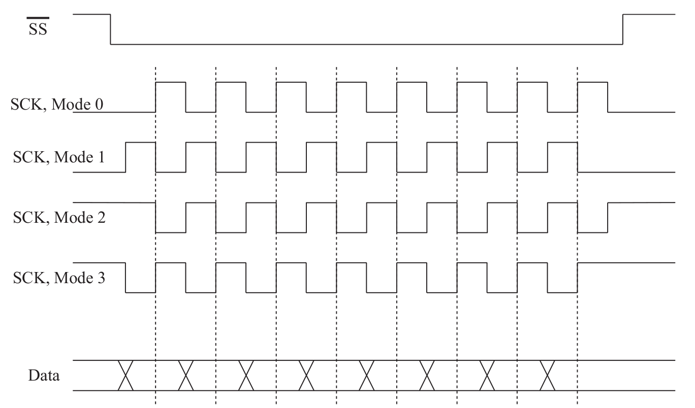

# Serial Communication Part 2: **I²C** and **SPI**

In the previous lesson we have analyzed the first (and perhaps most used in the amateur field) communication interface: the **UART**/**USART**

## Overview
Below it is reported a summary of the main serial communication interfaces - **UART**, **I²C** and **SPI** - for communicating with various devices and sensors.

- [Serial Communication](#comunicazione-seriale)
  - [Overview](#overview)
  - [Theoretical Requirements](#requisiti-teorici)
  - [UART e USART](#uart-e-usart)
    - [UART/USART nei microcontrollori STM32](#uartusart-nei-microcontrollori-stm32)
  - [I2C](#i2c)
    - [I2C in STM32 MCU](#i2c-nei-microcontrollori-stm32)
  - [SPI](#spi)
    - [SPI in STM32 MCU](#spi-nei-microcontrollori-stm32)
  - [Comunicazione USART in STM32Cube](#comunicazione-usart-in-stm32cube)
    - [Sending data acquired by ADC via UART](#invio-dati-acquisiti-da-adc-via-uart)
    - [UART in interrupt mode](#uart-in-modalità-interrupt)
    - [UART reception with DMA](#ricezione-uart-con-dma)
  - [I2C communication in STM32Cube](#comunicazione-i2c-in-stm32cube)
  - [SPI communication in STM32Cube](#comunicazione-spi-in-stm32cube)
  - [Exercises](#esercizi)

## I2C
The acronym **I²C** stands for "**I**nter **I**ntegrated **C**ircuit" and it is also a serial communication protocol that operates according to *master-slave* relationships.

It physically uses two wires (one for clock and one for data), which means that data only travels in one direction at a time.

As its name suggests, it is used for interconnections over fairly close distances, possibly with all the devices on the same integrated board, and allows the programmer to connect, at the same time, several *slaves* devices to a single *master*, using a single bus.

The mechanism to identify a particular *slave* device (among all the ones interconnected) is based on an addressing system according to which each device has a unique address for the **I²C** bus.

The communication, which is *half-duplex*, takes place on two lines, and takes place with a synchronous logic using two different signals:
* **SCL** (**S**erial **CL**ock)
* **SDA** (**S**erial **DA**ta)

<p align="center">
     
</p>

In addition to the data bits, on the **I²C** bus travels also a series of signals that operate as special delimiters in order to identify the *start* and the *stop* of the data flow. An **I²C** communication, based on the master-slave logic, follows specific rules. The first step is to send a *start* signal followed by the address (in 7-bit type) of the peripheral to communicate with. After that the device that is estabilishing a connection must specify, by means of a single bit, whether a reading (with a bit at 1) or a writing (with a bit at 0) communication is going to be carried out.

If the *slave* peripheral with the indicated address exists on the **I²C** bus, then it will respond with an ACK and the *master* will be able to initiate transmission or receive reception.

### I2C in STM32 microcontrollers
Taking as example the STMf446RE MCU, it is embedded with four **I²C** interfacing bus, which can operate in both *master* and *slave* modes; three of these bus can work in the standard mode (up to 100KHz) and also in a particular mode called fast mode (up to 400KHz).

Among the main features, it is possible to address with 7-bit or 10-bit values and well as an integrated hardware circuit for error control is provided.

In order to acquire a clear understanding of how each different mode operates, it is good idea to study the [reference manual](https://www.st.com/resource/en/reference_manual/dm00135183-stm32f446xx-advanced-arm-based-32-bit-mcus-stmicroelectronics.pdf) of the microcontroller. Infact, it contains a description of the two main modes of use:
- *Master mode*: 
> The **I²C** interface initiates a data transfer and generates the clock signal. A serial data transfer always begins with a start condition and ends with a stop condition. Both start and stop conditions are generated in master mode by software.
- *Slave mode*:
> In Slave mode, the interface is capable of recognizing its own addresses (7 or 10-bit), and the General Call address. The General Call address detection may be enabled or disabled
by software. 

Both data and addresses are transferred as single bytes, specifying the MSB (Most Significant Bit) as the first value.

<p align="center">
    
</p>
</br>

## SPI
Each STM32 microcontroller provides at least one **SPI** (**S**erial **P**eripheral **I**nterface) interface, which allows the programmer to develop *master-slave* logic applications in which a *master* device (for example the STM board) is interconnected with multiple external devices (for example sensors not already included in your PCB), which act as *slaves*. In this way, like we have seen for **I<sup>2</sup>C** communication, it is possible to greatly expand the communication possibilities of the microcontroller, which through a single peripheral, for example **SPI**, can communicate with many external devices.

It is a *synchronous* protocol that allows *full-duplex* or *half-duplex* communication of multiple devices on the same bus. When the *master* initiates a communication it selects one of the *slave* devices and sends it a byte that begins the data exchange; typically a unmeaningful byte (*dummy byte*) is used to start the communication.

The **SPI** protocol exploits mainly 4 signals:
* **SCLK** (**S**erial **CL**o**K**)
> This signal is used to generate the clock to synchronize data transfer over the **SPI** bus. It is generated by the master device, and this means that in an **SPI** bus every transfer is always
started by the master. 
* **MOSI** (**M**aster **O**utput **S**lave **I**nput)
> It is used to send data from the master device to a slave one. 
* **MISO** (**M**aster **I**nput **S**lave **O**utput)
> It is used to send data from a slave device to the master.
* **SSn** (**S**lave **S**elect on line **n**)
> In a typical **SPI** bus there exist 'n' separated lines used to address the specific **SPI** devices involved in a transaction.  In a typical **SPI** bus only one slave device can be active at same time by asserting low its **SS** line.

<p align="center">
     
</p>

Intrinsically, thanks to the presence of the two lines (**MOSI** and **MISO**), the **SPI** communication is of the *full-duplex* type; however, there is generally the possibility to use it also in *half-duplex* or *simplex*. If a single master is put in communication with a single slave on the **SPI** bus, the **SS** signal can be omitted and in general the two lines, **MISO** and **MOSI**, can be merged on a single line called **SISO** (**S**lave **I**n/**S**lave **O**ut).

**SPI** communication is perfect for applications that deal with digital signal processing in which is required a communication that involves fast data transfer with precise time recurrences.

In general, this communication standard is quite effective and efficient, moreover, many **SPI** devices turn out to be easy to use. Among the disadvantages, however, there is the lack of knowledge of the state of the receiver (lack of *ack* mechanism) and the difficulty in structuring a more complex system, with only one *master* and many *slaves* connected in physically distant places.

### SPI in STM32 microcontrollers
Up to 4 **SPI** interfaces can be used in the STM32F446RE microcontroller (5 for the F411RE), both in *master* and *slaves* modes and in *full-duplex* and *simplex* types.

The SPI1 and SPI4 interfaces guarantee communication up to 45Mbit/s while SPI2 and SPI3 operate up to a maximum of 22.5Mbit/s. This communication speed obviously depends on the system clock and on *prescaling* parameters that are selected in the configuration phase.

The **SPI** peripheral offers a hardware CRC system and can also be used for communication with external SD cards.

As particular methods of use, there is the possibility of operating in **TI** mode and **I2S** mode, the latter particularly useful in acoustic processing contexts.

<p align="center">
    
</p>

Since it is a synchronous communication, the **SCK** signal is of fundamental importance, which synchronizes the data traveling on the various lines. Furthermore, communication can take place in different formats which depend on the *phase of the clock* and its *polarity*. These parameters must be agreed by *master* and *slave* in order to communicate correctly; communication can be configured in four different modes, based on the choice of *polarity* and *phase* of the clock.

|Mode|CPOL|CPHA|
|:--:|:--:|:--:|
|  0 |  0 |  0 |
|  1 |  0 |  1 |
|  2 |  1 |  0 |
|  3 |  1 |  1 |
 
* At **CPOL** = 0 the base value of the clock is zero, i.e. the active state is 1 and idle state is 0.
    * For **CPHA** = 0, data is captured on the **SCK** rising edge and data is output on a falling edge.
    * For **CPHA** = 1, data is captured on the **SCK** falling edge and data is output on a rising edge.
* At **CPOL** = 1 the base value of the clock is one, i.e. the active state is 0 and idle state is 1.
    * For **CPHA** = 0, data is captured on **SCK** falling edge and data is output on a rising edge.
    * For **CPHA** = 1, data is captured on **SCK** rising edge and data is output on a falling edge.

<p align="center">
    
</p>

For more info, as well as the documentation of the microcontroller, it is possible to refer to the [guide released by Motorola](https://web.archive.org/web/20150413003534/http://www.ee.nmt.edu/~teare/ee308l/datasheets/S12SPIV3.pdf), regarding the **SPI** communication standard.
***
## I2C communication in STM32Cube
Below it is reported an example of **I²C** communication between the microcontroller and an external module which is the sensor [MPU-6050](https://invensense.tdk.com/products/motion-tracking/6-axis/mpu-6050/) of InvenSense.

In order to use this sensor (as you would do for any other **I²C** module) it is necessary to deeply study the documentation released by the manufacturer. Infact there all the physical/electrical informations are reported and also everything we need to know in order to retrive the measurements through the **I²C** interface.

Before moving on to the study of this module, the main structures and functions necessary to use a **I²C** communication needs to be clarified.  By making use of the **HAL** library the main structure is:
```c
typedef struct {
    I2C_TypeDef         *Instance;  // I²C registers base address
    I2C_InitTypeDef     Init;       // I²C communication parameters
    uint8_t             *pBuffPtr;  // Pointer to I²C transfer buffer
    uint16_t            XferSize;   // I²C transfer size
    __IO uint16_t       XferCount;  // I²C transfer counter
    DMA_HandleTypeDef   *hdmatx;    // I²C Tx DMA handle parameters
    DMA_HandleTypeDef   *hdmarx;    // I²C Rx DMA handle parameters
    HAL_LockTypeDef     Lock;       // I²C locking object
    __IO HAL_I2C_StateTypeDef   State;      // I²C communication state
    __IO HAL_I2C_ModeTypeDef    Mode;       // I²C communication mode
    __IO uint32_t               ErrorCode;  // I²C Error code
} I2C_HandleTypeDef;
```
where, among the various fields, we have: the pointer to the **I²C** device instance to use (`*Instance`), the structure instance used to specify the device configuration (`Init`) , the pointer to the internal buffer used for the temporary store of the data to be transferred (`pBuffPtr`) and other fields useful for managing errors and possibly communicating with the DMA module.

The structure used to configure the device is instead the following:
```c
typedef struct {
    uint32_t ClockSpeed;        // Specifies the clock frequency
    uint32_t DutyCycle;         // Specifies the I²C fast mode duty cycle.
    uint32_t OwnAddress1;       // Specifies the first device own address.
    uint32_t OwnAddress2;       // Specifies the second device own address if dual addressing mode is selected
    uint32_t AddressingMode;    // Specifies if 7-bit or 10-bit addressing mode is selected.
    uint32_t DualAddressMode;   // Specifies if dual addressing mode is selected.
    uint32_t GeneralCallMode;   // Specifies if general call mode is selected.
    uint32_t NoStretchMode;     // Specifies if nostretch mode is selected.
} I2C_InitTypeDef;
```
which contains all the parameters necessary to set up every characteristic of the **I²C** communication.

The set of functions used to operate with the **I²C** bus is very vast, there are in fact a whole series of functions necessary to manage every possible **ISR** generated (in transmission and reception) both in *master* and in *slave* mode. Below are reported only the main functions to use the microcontroller in master mode while please refer to [complete description of the **HAL** driver](https://www.st.com/resource/en/user_manual/dm00105879-description-of-stm32f4-hal-and-ll-drivers-stmicroelectronics.pdf) for more information.

The first function that comes in mind is definitely
```c
HAL_StatusTypeDef HAL_I2C_Init(I2C_HandleTypeDef *hi2c);
```
used to initialize the **I²C** bus. There are also a series of functions to manage sending and receiving trasmission by the master:
```c
HAL_StatusTypeDef HAL_I2C_Master_Transmit(I2C_HandleTypeDef *hi2c, uint16_t DevAddress, uint8_t *pData, uint16_t Size, uint32_t Timeout);
```
```c
HAL_StatusTypeDef HAL_I2C_Master_Receive(I2C_HandleTypeDef *hi2c, uint16_t DevAddress, uint8_t *pData, uint16_t Size, uint32_t Timeout);
```
which can also be used in interrupt mode:
```c
HAL_StatusTypeDef HAL_I2C_Master_Transmit_IT(I2C_HandleTypeDef *hi2c, uint16_t DevAddress, uint8_t *pData, uint16_t Size);
```
```c
HAL_StatusTypeDef HAL_I2C_Master_Receive_IT(I2C_HandleTypeDef *hi2c, uint16_t DevAddress, uint8_t *pData, uint16_t Size);
```

Obviously, the functions operate conceptually like those already shown for other peripherals (for example for **UART** peripherals); in this case you have a particular field which is the address of the device you want to communicate `DevAddress` to, as well as the pointer to an array that will contain the data you want to send or receive.

:rocket: Once the software tools to manage the operation of the bus and the **I²** protocol are clear, it is possible to study the details related to the sensor to be used and then proceed writing the program that will read the values it provides. The sensor in question, MPU-6050, is a *6 DOF IMU*, which is encapsulated on a **I²C** ready-to-connect module; this is connected to the development board as indicated.

<p align="center">
    
</p>

All the informations necessary for the implementation of a program that achieves correct communication with the sensor is obtained following the study of the [datasheet](docs/MPU-60x0-Datasheet.pdf) and the [documentation relating to the registers contained in the MPU-6050 form](docs/MPU-60x0-Register-Map.pdf). 

In such a context it makes sense to implement a *library* that deals with managing the sensor and mediating the **I²C** communication, as specified in the file [MPU-6050.md](MPU-6050.md). Thanks to the illustrated library it is possible to structure the `main.c` so that the functions exported from the library itself are invoked for the configuration and reading of the data from the sensor. But first it is essential to configure the **I²C** peripheral, using the *CubeMX* configuration interface.

<p align="center">
    
</p>

With the illustrated configuration, the code generated (and reported below) can be found in the `MX_I2C1_Init()` method:
```c
hi2c1.Instance = I2C1;
hi2c1.Init.ClockSpeed = 100000;
hi2c1.Init.DutyCycle = I2C_DUTYCYCLE_2;
hi2c1.Init.OwnAddress1 = 0;
hi2c1.Init.AddressingMode = I2C_ADDRESSINGMODE_7BIT;
hi2c1.Init.DualAddressMode = I2C_DUALADDRESS_DISABLE;
hi2c1.Init.OwnAddress2 = 0;
hi2c1.Init.GeneralCallMode = I2C_GENERALCALL_DISABLE;
hi2c1.Init.NoStretchMode = I2C_NOSTRETCH_DISABLE;
```

At this point, in the main function it is possible to read the data coming from the sensor connected via the **I²C** bus, obviously after an adequate configuration:
```c
/* Configure Accel and Gyro parameters */
Mpu_Config.Accel_Full_Scale = AFS_SEL_4g;
Mpu_Config.Clock_Source = INTERNAL_8MHz;
Mpu_Config.Config_Dlpf = DLPF_184A_188G_Hz;
Mpu_Config.Gyro_Full_Scale = FS_SEL_500;
Mpu_Config.Sleep_Mode_Bit = 0;  //1: sleep mode, 0: normal mode
MPU6050_Init(&hi2c1, &Mpu_Config); // Initialization - Configuration

/* Infinite loop */
while (1){
    MPU6050_Read_RawData(&Accel_Raw, &Gyro_Raw);
    MPU6050_Read_ScaledData(&Accel_Scaled, &Gyro_Scaled);

    HAL_GPIO_TogglePin(GPIOA, GPIO_PIN_5);
    HAL_Delay(1000);
}
```

***

## SPI communication in STM32Cube
To use the **SPI** device in the *STM32Cube* environment, the **HAL** library defines a **C** structure, `SPI_HandleTypeDef`, which contains the following fields:
```c
typedef struct __SPI_HandleTypeDef {
    SPI_TypeDef         *Instance;      // SPI registers base address
    SPI_InitTypeDef     Init;           // SPI communication parameters
    uint8_t             *pTxBuffPtr;    // Pointer to SPI Tx transfer Buffer
    uint16_t            TxXferSize;     // SPI Tx Transfer size
    __IO uint16_t       TxXferCount;    // SPI Tx Transfer Counter
    uint8_t             *pRxBuffPtr;    // Pointer to SPI Rx transfer Buffer
    uint16_t            RxXferSize;     // SPI Rx Transfer size
    __IO uint16_t       RxXferCount;    // SPI Rx Transfer Counter
    DMA_HandleTypeDef   *hdmatx;        // SPI Tx DMA Handle parameters
    DMA_HandleTypeDef   *hdmarx;        // SPI Rx DMA Handle parameters
    HAL_LockTypeDef     Lock;           // Locking object
    __IO HAL_SPI_StateTypeDef   State;      // SPI communication state
    __IO uint32_t               ErrorCode;  // SPI Error code
} SPI_HandleTypeDef;
```

where the main fields are: `Instance`, which points to the instance of the **SPI** device, for example `SPI1` (which is also a structure); `Init`, which is the structure with configuration parameters and then `pTxBuffPtr` and `pRxBuffPtr`, internal buffer pointers used for **SPI** data transmission and reception (used in interrupt mode).

The configuration structure, with the usual logic already presented for the other peripherals, is the following:
```c
typedef struct {
    uint32_t Mode;          // Specifies the SPI operating mode.
    uint32_t Direction;     // Specifies the SPI bidirectional mode state.
    uint32_t DataSize;      // Specifies the SPI data size.
    uint32_t CLKPolarity;   // Specifies the serial clock steady state.
    uint32_t CLKPhase;      // Specifies the clock active edge for the bit capture.
    uint32_t NSS;           // Specifies whether the NSS signal is managed by hardware (NSS pin) or by software
    uint32_t BaudRatePrescaler;     // Specifies the Baud Rate prescaler value
    uint32_t FirstBit;              // Specifies whether data transfers start from MSB or LSB bit.
    uint32_t TIMode;                // Specifies if the TI mode is enabled or not.
    uint32_t CRCCalculation;        // Specifies if the CRC calculation is enabled or not.
    uint32_t CRCPolynomial;         // Specifies the polynomial used for the CRC calculation.
} SPI_InitTypeDef;
```

As usual, the modes of use are mainly two: the *polling mode* and the *interrupt mode*; which are put into practice through the functions:

```c
HAL_StatusTypeDef HAL_SPI_Transmit(SPI_HandleTypeDef *hspi, uint8_t *pData, uint16_t Size, uint32_t Timeout);
```

```c
HAL_StatusTypeDef HAL_SPI_Receive(SPI_HandleTypeDef *hspi, uint8_t *pData, uint16_t Size, uint32_t Timeout);
```
```c
HAL_StatusTypeDef HAL_SPI_Transmit_IT(SPI_HandleTypeDef *hspi, uint8_t *pData, uint16_t Size);
```

```c
HAL_StatusTypeDef HAL_SPI_Receive_IT(SPI_HandleTypeDef *hspi, uint8_t *pData, uint16_t Size);
```

In addition, in the case of **SPI** *full-duplex* communication, these special functions are used:
```c
HAL_StatusTypeDef HAL_SPI_TransmitReceive(SPI_HandleTypeDef *hspi, uint8_t *pTxData, uint8_t *pRxData, uint16_t Size, uint32_t Timeout);
```
```c
HAL_StatusTypeDef HAL_SPI_TransmitReceive_IT(SPI_HandleTypeDef *hspi, uint8_t *pTxData, uint8_t *pRxData, uint16_t Size);
```

As for the *interrupt mode*, the classic mechanism is used whereby the **ISR** invokes the `HAL_SPI_IRQHandler ()` function inside it, which will automatically invoke one of several *callbacks* such as `HAL_SPI_TxCpltCallback ()` or `HAL_SPI_RxCpltCallback ()`, depending on the event triggering the **ISR**.

:twisted_rightwards_arrows: For an example of use of an external **SPI** device, we use a *Shift Register*, described a little more in detail in the file[74HC595-ShiftRegister.md](74HC595-ShiftRegister.md), which also reports the specifications and references of the device used: the model **SN74HC595** by Texas Instruments.

<p align="center">
    
</p>

In the following example we will use the *Shift Register*, connecting it to the *SPI1* interface of the microcontroller, using some of its parallel outputs to manage an RGB LED.

The value that is sent to the device, via **SPI**, will each time be an 8-bit unsigned variable (`uint8_t`) which represents the color to be lit on the RGB LED. The three lines of the LED are in fact connected to three outputs of the *Shift Register*. For example, when the binary value `00000010` is sent, at the output there will be only **QB** set at the high value and all the others left to 0. Based on the connection made, shown in the figure, the red of the RGB LED will light up. For a value instead of `00101010`, all three colors will turn on, resulting into white light.
```c
/* Define Colours- Shift Register Outputs
* QA -> NO
* QB -> RED
* QC -> NO
* QD -> GREEN
* QE -> NO
* QF -> BLU
*
* Q-H G F E D C B A
* 0b0 0 0 0 0 0 0 0
* */

#define RED 0b00000010
#define GRE 0b00001000
#define BLU 0b00100000
#define ORA 0b00001010
#define VIO 0b00100010
#define LBL 0b00101000
#define WHI 0b00101010
```
For **SPI** peripheral configuration we use *CubeMX*, using pins PA_5 and PA_7 for **SCK** and **MOSI** and a GPIO on port B (PB_6) for the **signal RCLK** of the *Shift Register*. Configure the transmission mode to handle only the *master* transmission and use a *prescalar* to slow down the transmission speed, since in the example shown it will not be necessary to work with high rates.

<p align="center">
    

</p> 

To manage the output on the *Shift Register*, a function is implemented that encapsulates the transmission method exported from the **HAL** library. Note also that pin PB_6 is used with the operating logic with which the **RCLK** signal of the *Shift Register* operates: after having transmitted the data via **SPI**, when a rising edge on the pin PB_6 accurs then the data is loaded into the *Shift Register* and, in the same time, sent to the output.

```c
void ShiftReg_out(uint8_t *data, uint16_t size){
	  HAL_GPIO_WritePin(GPIOB, GPIO_PIN_6, GPIO_PIN_RESET);
	  HAL_SPI_Transmit(&hspi1, data, size, 100);
	  HAL_GPIO_WritePin(GPIOB, GPIO_PIN_6, GPIO_PIN_SET);
}
```

Finally, for an interactive management of the application, the **UART** communication is used, in reading with *polling*, to receive a command that indicates which color to light up, and therefore which 8-bit binary value to send, via **SPI**, to the *Shift Register*.

```c
while (1){
    HAL_UART_Receive(&huart2, (uint8_t*)read_char, 1, HAL_MAX_DELAY);
    switch(read_char[0]){
        case 'R':
            outputBuffer[0] = RED;
            break;
        case 'G':
            outputBuffer[0] = GRE;
            break;
        case 'B':
            outputBuffer[0] = BLU;
            break;
        default:
            outputBuffer[0] = WHI;
        break;
    }
    ShiftReg_out(outputBuffer, 1);

    HAL_Delay(500);
}
```


## Exercises
:pencil: 
The main goal is that to write a program that emulates the behaviour of a controller used for *Binary Automatic Water Tank Level Tracking*. The general structure of the control system is shown in the figure below. The program must acquire data from a sensor located in the *Measurement System* module. For sake of simplicity, we will assume a linear potentiometer is used to measure the *Actual Level* of the water in the tank. Is up to the student to decide the configuration of the ADC in order to retrieve this data. Via **UART** communication, if required, the actual measure of the water level should be sent. In this case if a specific command (for example a single character: 'K') is received, the MCU should provide the requested data. On the other hand, again via **UART** communication, with the interrupt logic or using DMA, the MCU receives a specific message with value to be tracked, called *Reference Level*. The reference should be valid only if the message received is in the form *R XXX* (optional, even just the value *XXX* is enough). It is necessary to check if the received value is coherent with the MAX_HEIGHT_VALUE and MIN_HEIGHT_VALUE setted in an arbitrary way by the student. 

<p align="center">
    
</p> 


The main goal is that to keep the *Actual Level* as close as possible to the *Reference Level*. Using Digital I/O, open/close two on/off valves located on top and at the bottom of the tank in order to regulate the water level to the desired value. 

The logic conditions to control the water level are the following: 
* if *Actual Level* is greater than *Reference Level*, then close top valve and open bottom valve;
* if *Actual Level* is less than *Reference Level*, then open top valve and close bottom vale;

It is important that to each valve there is a LED associated, to indicate the state of the valve. For this reason, use another 2 Digital I/O pins to control the just mentioned LEDs. 
If possible, implement a "library" dedicated to managing the *Binary Automatic Water Tank Level Tracking* System.

*** 
