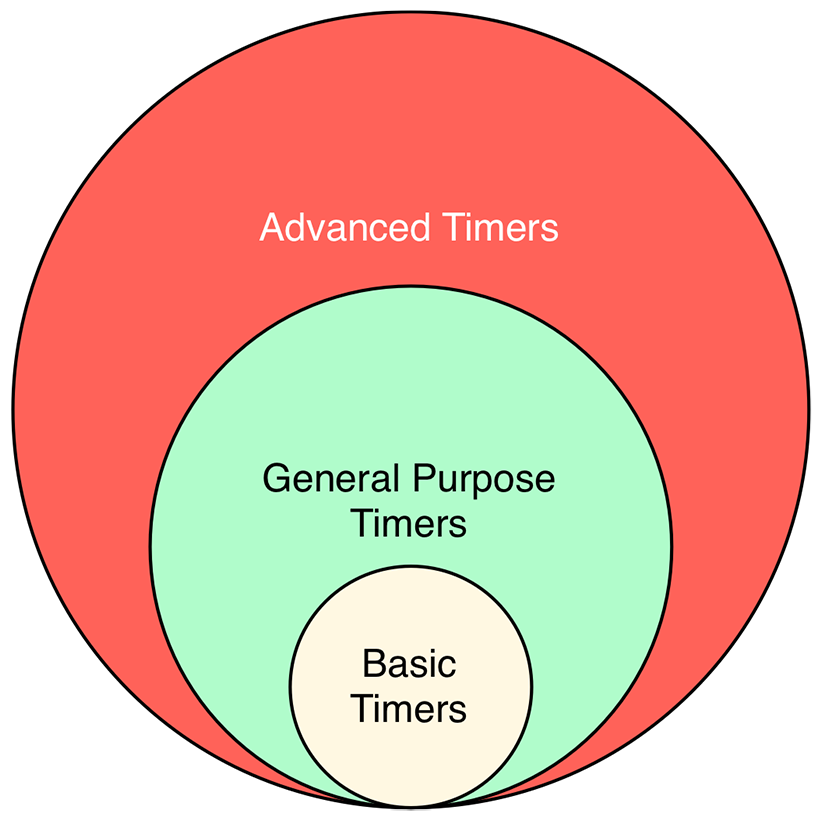
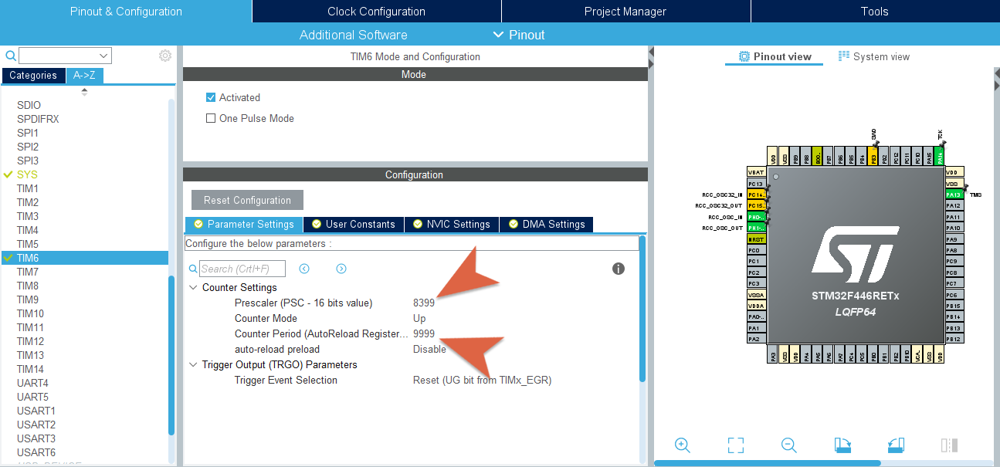
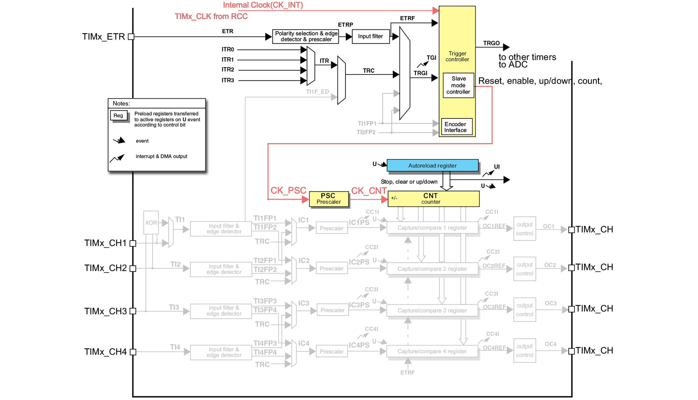
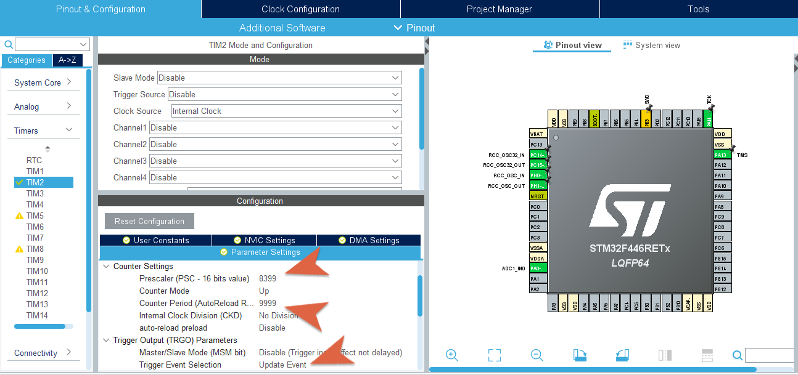
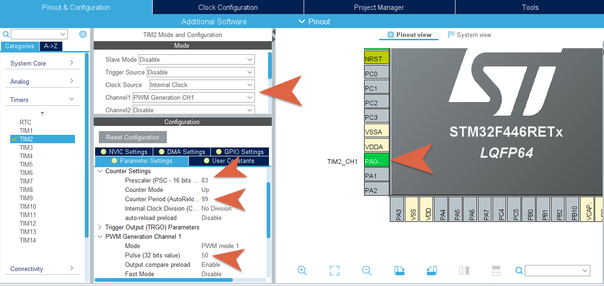

# Timers e PWM

</br>


## Overview
In this lesson the use of **timers** and **PWM** signals in *STM32Cube* is analyzed using a series of exercises and examples.

## Timers

### Theorical Overview
Many times in the development of a program it is necessary, for various reasons, to *wait* for somenthing to happen. It can be possible to use `HAL_Delay()` in a very simple and straightforward  way but such a function is *blocking* function for the microcontroller.

In most embedded systems, the exact knowledge of how much time has passed can be essential for time management and often providing an immediate response to a certain event is crucial. A wait that makes the CPU "waste time" is not appropriate and that's why all microcontrollers provide *dedicated hardware peripherals* for time management: **Timers**.

A **timer**, as a hardware device, is a counter that performs its *count* operations with a frequency that is somehow related to the *clock* source of the MCU,  both internal or external. This count is carried out by increasing (or decreasing) the value contained in suitable registers until an *overflow* situation occurs, which causes an **interrupt**. The maximum value beyond which the *overflow* occurs depends on the **timer** resolution (for example, for a **timer** with 16 bit resolution the maximum value is 65535).

The main elements that constitute a **timer** peripheral are:
- A *prescalar*;
- A register in which the current value of the **timer** is kept: *timer register*;
- A register that saves the value of the *timer register* when particular events accurs: *capture register*;
- A register that contains a value that is periodically compared with the value of the *timer register*: the *compare register*.

Thanks to these it is possible to manage, even with the **interrupts** mechanism, the **timers**, using them in different ways.

### Timers in STM32 microcontrollers

Up to 17 **timers** can be used in the STM32F466RE microcontroller, as reported in the datasheet:
> 2x watchdog, 1x SysTick timer and up to twelve 16-bit and two 32-bit timers up to 180 MHz.
<p>

	
Like for the other microcontrollers of the STM32 family, these are logically divided as follows
* *Advanced-Control Timers* : TIM1, TIM8 (16 bit)
* *General-Purpose Timers* : TIM2, TIM5 (32 bit) | TIM3, TIM4, TIM9-TIM14 (16 bit)
* *Basic-Configuration Timers* : TIM6, TIM7 (16 bit)

According to its type, a **timer** can be used in different *modes*, the main ones are: *compare mode*, *capture mode*, and *PWM mode*. These allow the programmer to use a **timer** not only to perform counter functions but also to create more complex functions. In the next part of the lesson we will analyse, as already specified, what are the main ingredients (the internal components and main registers) in order to set up these modes. Note that a *general purpose timer* can be used to serve the same purposes as a *basic timer*, but the contrary is not true.
</p>

An accurate description of the characteristics of the **timers**, can be found on [datasheet](https://www.st.com/resource/en/datasheet/stm32f446mc.pdf) and [reference manual](https://www.st.com/resource/en/reference_manual/dm00135183-stm32f446xx-advanced-arm-based-32-bit-mcus-stmicroelectronics.pdf); below is reported a table that schematizes the main characteristics.

<p align="center">
    
</p>

Each type of **timer** must be used appropriately taking into account its capabilities and characteristics; even in a development environment like *STM32Cube*, using the **HAL** driver, the programmer needs to refer to different functions and structures in order to use the different types of **timers**.

## Using Timers in STM32Cube

### :alarm_clock: Basic Timers
> The basic timers **TIM6** and **TIM7** consist of a 16-bit auto-reload counter driven by a programmable prescaler.</br>
They may be used as generic timers for time-base generation but they are also specifically used to drive the digital-to-analog converter (DAC).

Once we have knowledge on how a **timer** of this type works, it is possible to properly put it into operation using the **HAL** library, referring to functions of the type `HAL_TIM_Base_xxx` and to a series of structures, such as the following:

```c
typedef struct {
    TIM_TypeDef                 *Instance; // Pointer to timer descriptor 
    TIM_Base_InitTypeDef        Init;      // TIM Time Base required parameters
    HAL_TIM_ActiveChannel       Channel;   // Active channel 
    DMA_*HandleTypeDef           *hdma[7];  // DMA Handlers array 
    HAL_LockTypeDef             Lock;      // Locking object 
    __IO HAL_TIM_StateTypeDef   State;     // TIM operation state 
} TIM_HandleTypeDef;
```
```c
typedef struct {
    uint32_t Prescaler;      //Specifies the prescaler value used to divide the TIM clock.
    uint32_t CounterMode;    //Specifies the counter mode.
    uint32_t Period;         //Specifies the period value to be loaded into the active Auto-Reload Register at the next update event.
    uint32_t ClockDivision;  //Specifies the clock division.
    uint32_t RepetitionCounter;  //Specifies the repetition counter value.
} TIM_Base_InitTypeDef;
```
for which an accurate description can be found in the [**HAL** driver descriptive manual](https://www.st.com/resource/en/user_manual/dm00105879-description-of-stm32f4-hal-and-ll-drivers-stmicroelectronics.pdf). These are the basic structures used by all types of **timers**, from *basic* to *advanced* ones, to realize the basic counting functions.

Among the most relevant fields of the `TIM_Base_InitTypeDef` structure are the `CounterMode` field (which specifies the mode and the "direction" with which the count is performed), the `Prescalar` and` Period` fields (crucial to define a **timer** that works as desired); the latter must be configured following the formula:

<p align="center">
    
</p>

This is an essencial process when trying to manage the *overflow* of the timer, also generally called *update event*.
Starting from the known value of the system clock frequency, it is possible to set the other two values to obtain an *update event* equal to the desired frequency value for the event linked to the **timer**.

A first simple example can be created in *STM32Cube* by flashing an LED using the **timer** TIM6: we use *STM32CubeMX* to configure the **timer** and then we use functions exported from the library **HAL** to manage the **timer** with an *interrupt* mechanism. 

TIM6 is a basic **timer** and it is not linked to any external pin; its configuration only passes through the setting of the fields of the structures indicated above; the main fields are *prescalar* and *period*. To configure them appropriately, remembering the formula written above, the programmer can divide the clock frequency by a value such as to obtain a prescaling lower than 65535 and then manage the value of the period to obtain the desired *update event*.

For a clock at 84Mhz, it is possible to identify as the value of *prescalar* 8399 (= 84000000/10000) and as *period* 9999, the latter is selected to obtain 1Hz as the *update event*.

<p align="center">
    
</p>

After setting these parameters in *STM32CubeMX* and generating the code, we make use of the functions:
```c
HAL_TIM_Base_Init(&htim6);     // Configure the TIMER
HAL_TIM_Base_Start_IT(&htim6); // Start the TIMER
```
to start the **timer** in *interrupt* mode.

At this point its management is done through the **ISR** which must have the name `TIM6_IRQHandler()`. When this **ISR** is triggered (when the **timer** goes into *overflow*) the `HAL_TIM_IRQHandler()` function is called, which automatically handles the event and calls `HAL_TIM_PeriodElapsedCallback()`. Within the latter, the event will be properly managed and, for the purpose of this example, the status of the LED will be changed (connected for convenience on PA_5).

```c
void TIM6_IRQHandler(void) {
	HAL_TIM_IRQHandler(&htim6);
}

void HAL_TIM_PeriodElapsedCallback(TIM_HandleTypeDef *htim) {
	if(htim->Instance == TIM6){
		GPIOA->ODR ^= (0x1 << 5);
	}
}
```

The programmer can analyze the self-generated code to evaluate how the main structure `TIM_HandleTypeDef` is managed and also change directly the code found in the` MX_TIM6_Init() `function to check the effects of different configurations.

</br>

As a further example, the calculation done to determine an *update event* of 2Hz is reported. By setting the clock value at 84Mhz and the *prescalar* (as before) at 8399, we use this inverse formula:
<p align="center">

</p>

obtaining a *period* value equal to 4999 and ultimately the desired *update event* of 2Hz (500ms). Obviously, attention must be paid to the fact that the clock must be configured at 84MHz, so that the calculations made are coherent; the programmer can analyze the *Clock Configuration* window to check the clock settings.

<p align="center">
    
</p>

<br>

### :watch: General Timers
> The general-purpose timers consist of a 16-bit or 32-bit auto-reload counter driven by a programmable prescaler.</br>
They may be used for a variety of purposes, including measuring the pulse lengths of input signals (input capture) or generating output waveforms (output compare and **PWM**).

Most **timers** are *generalpurpose*; compared to the "basic" ones, they offer much more functionalities and interaction capabilities. They are in fact used, for example, for the generation of particular signals (**PWM**) and the microcontroller offers 4 independent channels dedicated to interfacing these **timers** with external peripherals.

<p align="center">
    
</p>

By evaluating this scheme, reported in the documentation of the microcontroller, it is possible to understand how many signals related to the clock and/or to *trigger* signals (internal or external) intervene when we use of this type of **timers**.

It is also important to note that these **timers** can be managed with clock signals external to the microcontroller; in fact, in the **HAL** driver there is a structure that serves precisely to control this specification.

```c
typedef struct {
    uint32_t ClockSource;       // TIM clock sources
    uint32_t ClockPolarity;     // TIM clock polarity
    uint32_t ClockPrescaler;    // TIM clock prescaler
    uint32_t ClockFilter;       // TIM clock filter
} TIM_ClockConfigTypeDef;
```
and there are also a series of constants, already defined, which allow the programmer to configure each of these fields.

These features allow an advanced use of **timers** according to *master/slave* type mechanisms.

Furthermore, these **timers** can also be used as *triggers* for the **ADC** peripheral; in fact, the use of **TIM2** to manage **ADC** conversions is shown below; to do this, some structures and functions defined in the **HAL** library (such as `TIM_HandleTypeDef`, described previously) are used in the same way as for *basic timers*.

Also in this case the code generation functionality of *STM32CubeMX* is exploited by separately configuring the **timer** 2 (`TIM2`) and the **ADC** (` ADC1`) peripheral.

<p align="center">
    
</p>

<p align="center">
    
</p>

The images show the main fields that are modified to implement the following example: the **ADC** will be used to acquire values from a temperature sensor and the conversion will be controlled by an external *trigger* (defined with the help of **timer two**).

The temperature sensor is connected to channel 0 of the **ADC**, as already shown in the previous exercise, and the conversion of the voltage values acquired into temperature values is carried out with the formula obtained from the information on the sensor datasheet used (*Texas Instrument* LMT84).

The **ADC** operating logic will make use of the *interrupts* mechanism as already shown. In this case the **ISR** will trigger on the occurrence of the *update event* of **timer two** with a frequency of 1Hz.

## **P**ulse **W**idth **M**odulation (**PWM**)
Through a **DAC** it is obviously possible to output any type of analog signal but, the most effective way to generate a rectangular waveform is certainly the **pulse width modulation** ( **PWM**). The control, in terms of voltage or current, with this type of modulation is used in many applications, from telecommunications to automatic control.

Basically, a pulse width modulation operates on the variation, within the wave period, of the length of the high pulse (or *on* time) and consequently on the length of the low pulse (or *off* time) .

The proportion between the *on* time and the entire **T** period is called **duty cycle**, and it is a fundamental concept for working with the **PWM**: a **duty cycle** of  100% means that the signal is continuously high, while 0% means that the signal is always low.

<p align="center">
    
</p>
<p align="center">
    
</p>

Linked to the **duty cycle** is the **average value** of the generated signal, which obviously is proportional to the length of the *high* signal (*on* time); by changing the **duty cycle** value, the **average value** changes accordingly.

To generate a signal of this type in a microcontroller, a **timer** is used in *PWM mode*: based on the relationship between the current value of the counter and the values stered in the *compare register* and *capture register* is it possible to define whether the value of an output signal should be high or low.

## PWM generation in STM32Cube
A **PWM** signal can be generated using a *general purpose timers* in *PWM* mode, which is very similar to the *output compare* mode.

*STM32CubeMX* can be used to manually configure a **timer**, with internal clock source; the development environment offers the possibility to configure one of the **timer** channels as *PWM Generation* and this automatically enables one of the board pins to generate the desired signal in output.

Surely, the most delicate aspect of the configuration concerns the choice of the parameters of *prescalar*, *period* and *pulse* (value closely linked to the *period*), with which the **duty cycle** of the signal is effectively adjusted.

For a first example we want to create a **PWM** with **duty cycle** of 50% and, having identified the system clock at 84MHz, we choose a *prescalar* value equal to 84, in order to reduce the clock at 1MHz, at this point we choose the *period* value equal to 100 in order to further scale the signal to 10KHz. These considerations are always made on the basis of the main formula for adjusting the *update event* value of the **timers**.

<p align="center">
    
</p>

Once this value is set, we can proceed to the *pulse* parameter related to the **duty cycle**. With this setting it becomes trivial to set find the correct value. Infact we just need a value of 50 to obtain a **duty cycle** of 50%.

If, on the other hand, by always lowering the clock to 1MHz, we set the *period* to, for example, 300 then in order to have 50% *duty cycle* we need to set the *pulse* parameter to a value of 150.

<p align="center">
    
</p>

Note that, automatically, after enabling channel 0 of **timer** 2, pin PA_0 of the microcontroller is activated.

By invoking the automatic code generation, *STM32CubeMX* will take care of generating the code necessary to configure the structures related to the **timer** 2 and its parameters. All this can be found in the `MX_TIM2_Init()` function, which we will need to use if we want to change the **PWM** signal generation parameters.

To start the generation of the **PWM** signal, the method to be invoked is:
```c
HAL_TIM_PWM_Start(&htim2, TIM_CHANNEL_1);
```
with the instance of the **timer** in use and the reference to the channel  (the *keyword* `TIM_CHANNEL_1` identifies the previously configured channel).

For an adequate analysis of the generated signal and to appreciate the **duty cycle** variations as the **timer** parameters vary, the best way is to use an oscilloscope. With the code described, by varying the *duty cycle* between 50% and 80%, what we will get is the following result:

<p align="center">
    
</p>

Another way to evaluate the effects of a **PWM** signal is to use its average value to manage the intensity of an LED. The variation of this average value obviously passes through a variation of the **duty cycle**.

As the **duty cycle** increases, the average value increases, varying, as a voltage signal, from 0V to 3.3V.

The values are therefore chosen:
```c
htim2.Init.Prescaler = 839;
htim2.Init.Period = 999;
```
to display a "slower" change in intensity of the LED, in the main life cycle, a portion of code that changes **duty cycle** on line is inserted.
```c
uint16_t dutyCycle = HAL_TIM_ReadCapturedValue(&htim2, TIM_CHANNEL_1);

while(1) {
    // Increase duty cycle
    while(dutyCycle < __HAL_TIM_GET_AUTORELOAD(&htim2)) {
        __HAL_TIM_SET_COMPARE(&htim2, TIM_CHANNEL_1, ++dutyCycle);
        HAL_Delay(1);
    }

    HAL_Delay(1000); // Wait

    // Decrease duty cycle
    while(dutyCycle > 0) {
        __HAL_TIM_SET_COMPARE(&htim2, TIM_CHANNEL_1, --dutyCycle);
        HAL_Delay(1);
    }

    HAL_Delay(500); // Wait;
    }
}
```

***

</br> </br>

## Exercises

:pencil: Implement, in *STM32Cube*, a program that makes use of the **ADC** to read the values of a potentiometer. Acquire these values with an 8-bit resolution (obtaining values between 0 and 255) and use these values to manage the brightness of an LED, with a **PWM** signal.

Make sure that the **duty cycle** varies proportionally to the value read by the potentiometer. Pay attention to the fact that, obviously, the **duty cycle** varies between 0 and 100 and not between 0 and 255, as it happens instead for the values read by the potentiometer.

:interrobang: Briefly explain how the *capture mode* works with **timers**.

:question: For a *basic timer* in a 42Mhz clocked system, how can the *prescalar* and *period* be chosen to get a 300ms *update event*?
