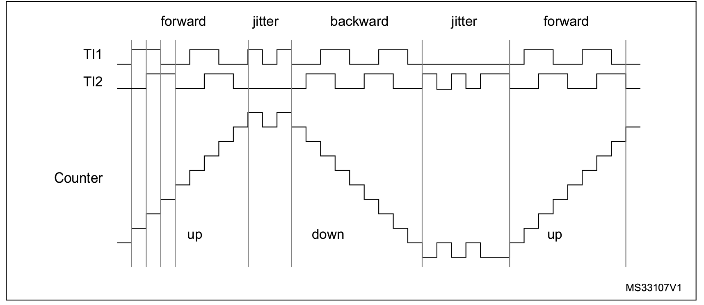
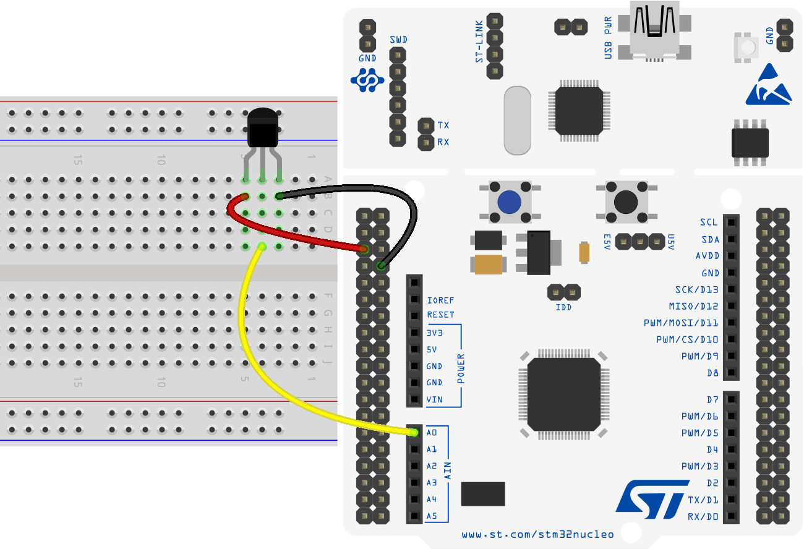
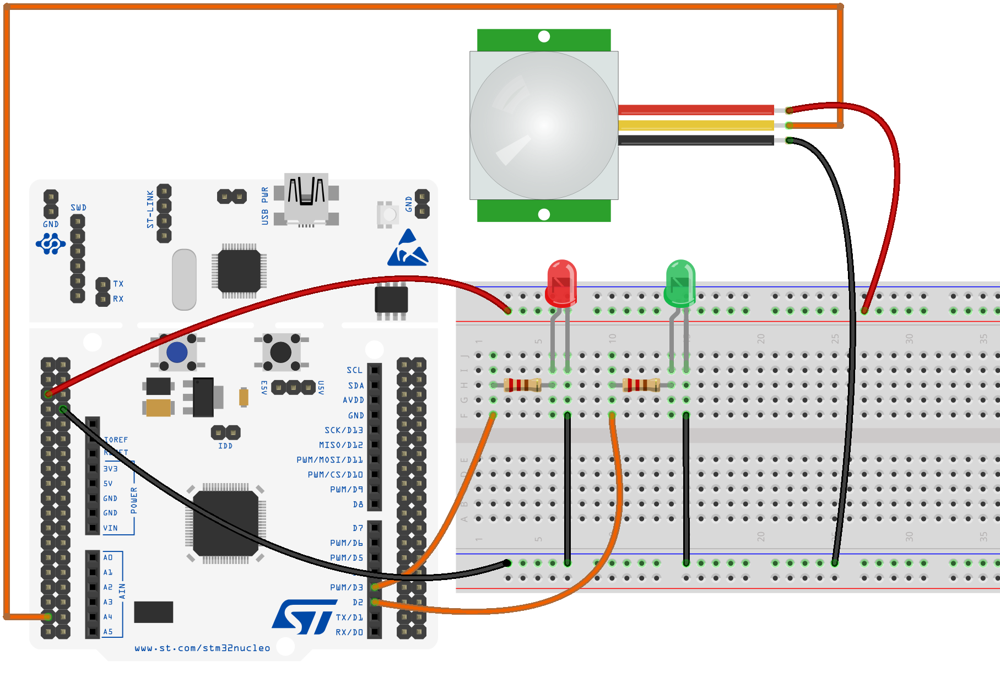

# Sensors
### Sensors for Embedded Control

***
</br>


## Overview 
Below there are some examples of use of some sensors that can be used in an Embedded Control System.

* [Rotary Encoder](#Rotary-Encoder)
* [Ultrasonic Proximity Sensor](#Sensore-di-Prossimità-ad-Ultrasuoni)
* [Temperature Sensor](#Sensore-di-Temperatura)
* [Inertial Measurment Unit (IMU)](#Piattaforma-Inerziale-(IMU))
* [Infrared Motion Sensor](#Sensore-di-Movimento-a-Infrarossi)


</br></br>

## Rotary Encoder

The module used is a **digital rotary encoder**: an electro-mechanical device that transmits, through digital signals, information related to the motion of a shaft. 

<p align="center">
  
</p>


The digital output therefore provides information about the movement of the metal rod; information that can be processed to determine, generally, a rotational speed, a position, or a traveled distance.

Encoders, in different forms, are used in many applications involving industrial control or robotics, they are also found in remote control systems or laboratory equipment such as rheometers.

The device being analyzed is an incremental rotary encoder that uses two output signals to determine the movement of the metal rod, these are called "in quadrature" since they are out of phase by 90 degrees.

<p align="center">
  
</p>


Based on the analysis of the two outputs, it is possible to determine the direction of rotation and, by counting the occurrences of the signals, determine the rotation speed or position.

For a device of this type, many ST microcontrollers provide direct support via the *timers*, as also reported in the *reference manual*:


> **TIM1 & TIM8** timer features include: 
> * Supports incremental (quadrature) encoder and Hall-sensor circuitry for positioning
purposes

In this mode, the *timer* is used as if the encoder were for him an external clock source; the counter (`CNT`) therefore varies between 0 and the value of *auto-reload* (`ARR`), both increasing and decreasing, and the mode works with the logic called "X4".

With this mode it is therefore possible to obtain information about the position of the sensor, from which speed or acceleration can also be calculated, useful parameters if the sensor is used for operations concerning the speed regulation of an engine.

<p align="center">
  
</p>

The use of this module is done with *STM32Cube*, passing through a first graphical configuration in *CubeMX*. The encoder used performs 20 steps to perform a complete rotation, given the operating mode of the *encoder mode* it is necessary to choose the `counter` value appropriately. The other settings remain at their defaults, except for `Encoder Mode`, which is used to make the counting occur on both channels of the *timer*.


<p align="center">
  
</p>

After configuration, in the `main ()` function, the timer is started in *encoder mode* with *interrupt* and in the main life cycle the encoder values are sent via *UART*.

```c
...
HAL_TIM_Encoder_Start_IT(&htim2, TIM_CHANNEL_1 | TIM_CHANNEL_2);
HAL_TIM_Base_Start(&htim2);

/* Infinite loop */
while (1){
  // Get Encoder Value from timer
  encoder_val = TIM2->CNT;
  sprintf(uart_data_buff, "\r%d\n", encoder_val/4);

  // UART TX
  HAL_UART_Transmit(&huart2, (uint8_t *)uart_data_buff, sizeof(uart_data_buff), HAL_MAX_DELAY);
  HAL_Delay(100);
}
```
<p align="center">
  
</p>

An encoder of this type is mainly used for "selection" operations in teleoperation contexts rather than for the calculation of a rotation speed (due to its low resolution), therefore essentially its position is used.

In general, however, encoders are mainly used for speed measurements, perhaps of the rotor of a motor. Probably the simplest and most effective method consists in measuring the frequency of the encoder impulses and transforming it into an angular velocity measure: the number of impulses in a fixed time window are counted and the angular velocity is determined as:

<p align="center">
  
</p>

where  represents the number of impulese for each complete rotation.  is the number of pulses measure in a time window referred to as .

</br>

## Ultrasonic Proximity Sensor 

Sensors of this type generally use an ultrasonic signal, with a frequency of 40 KHz, to determine the distance from what they have in front of them. The transmitted wave is reflected by the obstacle and goes back to the sensor which determines the time of flight of the wave and, knowing the speed of sound in the air, allows the calculation of the distance from the obstacle.

The module used is *HC-SR04*, which allows you to determine the distance of an obstacle between 2cm and 4m, with a resolution that can reach 3mm. It is a module that contains both transmitter and receiver, located on the same axis.

<p align="center">
  
</p>

Every detail can be found on its datasheet [datasheet](docs/HCSR04-datasheet.pdf), from which the particular logic with which it must be used is also extracted. The steps to be taken to determine the distance are in fact:


* Keep the pin `TRIG` HIGH for 10 μs
* Wait for the 8 ultrasound cycles at 40 KHz without doing anything
* When the signal starts to go back, intercept the high value of the `ECHO` pin and calculate the time it remains high
* Determine the distance using the duration (in μs) of the high `ECHO` signal and the speed of sound in air
* Wait at least 60 ms before taking a new measurement

<p align="center">
  
</p>

Note the speed of sound in air (343.1m/s at 20° or 0.0343cm/μs) the distance traveled by the wave is determined according to a relationship that combines time and speed.
So from

<p align="center">
  
</p>

using the speed of sound in air we obtain:

<p align="center">
  
</p>

where **t** is the time of flight of the wave in air, which corresponds to the time for which the `ECHO` signal remains high. However, it must be kept in mind that the wave travels the same distance twice, when emitted towards the object and after reflection towards the sensor; it is therefore necessary to divide the calculated distance by two. Definitely:

<p align="center">
  
</p>

<p align="center">
  
</p>


The following is an example of the use of this sensor in a program which, in *STM32Cube*, uses the *timers* to manage the sensor and acquire the distance measurements, which are then sent via *UART* to a control terminal.

<p align="center">
  
</p>

In the *CubeMX* interface you configure the *timer* so that its increment allows you to keep track of the passage of time in microseconds. Once the system clock is set at 84MHz, the prescaling at 84 is chosen in order to have a clock that varies at 1Mhz; the maximum value of the counter is also chosen: 0xffff (65535).

<p align="center">
  
</p>


To compute the time duration in microseconds, a specific *delay* function is implemented:

```c
void delay_us(uint32_t us){
	__HAL_TIM_SET_COUNTER(&htim1, 0);
	while ((__HAL_TIM_GET_COUNTER(&htim1)) < us);
}
```

Which brings the *timer* counter to 0 and waits for its increment to reach the desired value; the timer increments the counter value by one unit every microsecond.

Using this function it is possible to write a method that commands the reading from the ultrasonic sensor:
```c
uint32_t HCSR04_read(void){
	echo_time = 0;

	// Pull TRIG pin low for at least 2 us
	HAL_GPIO_WritePin(GPIOA, GPIO_PIN_1, GPIO_PIN_RESET);
	delay_us(2);

	// Keep TRIG pin High for 10 us for start the sensor
	HAL_GPIO_WritePin(GPIOA, GPIO_PIN_1, GPIO_PIN_SET);
	delay_us(10);
	HAL_GPIO_WritePin(GPIOA, GPIO_PIN_1, GPIO_PIN_RESET);

	// Wait for the ECHO pin to go high
	while (!(HAL_GPIO_ReadPin(GPIOA, GPIO_PIN_4)));
	// Measure time for which the pin is high
	while (HAL_GPIO_ReadPin(GPIOA, GPIO_PIN_4)){
		echo_time++;
		delay_us(1);
	}
	// The delay of 1us give 1.8us (measured by scope)
	return echo_time*1.8;
}
```
Note that the actual value of the measured "echo time" must be multiplied by 1.8 as the precision of the timer allows you to evaluate variations of 1.8μs instead of 1μs. This result can be deduced from an experimental analysis with an oscilloscope.

The distance in the main program life cycle is then determined from the `echo_time` value.
```c
/* Infinite loop */
while (1){
  // Read from sensor
  sensor_time = HCSR04_read();
  // d = (t * 0.0343)/2
  distance  = sensor_time * (0.0343)/2;
  // UART TX
  sprintf(uart_data_buff, "\r%.5f\n", distance);
  HAL_UART_Transmit(&huart2, (uint8_t *)uart_data_buff, sizeof(uart_data_buff), HAL_MAX_DELAY);
  // Delay (at least 60ms before new read)
  HAL_Delay(100);
}
```
In the serial terminal it is possible to view the measurement obtained by the proximity sensor by placing it in front of an obstacle at a variable distance. Pay attention to let at least 60ms pass between one measurement and the next, as specified in the datasheet.

</br>

<!---
## Temperature Sensor
A temperature sensor from *Texas Instrument* is taken as a reference:  [LMT84](docs/lmt84.pdf). All information regarding the connection with the board and the transformation of the voltage signal read into a temperature value can be found by consulting the [datasheet](docs/lmt84.pdf) of the sensor. 

<p align="center">
    
</p>

It is an analogue temperature sensor, with a linear characteristic that provides a temperature between -50° and 150°. To use it, an ADC is used which returns a value in *mV*, to convert this voltage value into a temperature value, a transformation formula extracted from the one reported on the datasheet is used:

<p align="center">
    
</p>


from which, by means of an inverse formula, the temperature  **<em>T</em>** is easily obtained.

<p align="center">
    
</p>


:traffic_light: Different Examples can be found [qui](https://github.com/p-ansatz/FPSE-Esercitazioni/tree/master/Esercitazione%206%20-%20IO%20Analogico#io-analogico-con-stm32cube).

--->

</br>

## Inertial Measurement Unit (IMU)

Having known the software tools to manage the operation of the bus and the **I²C** protocol, it is possible to study the details relating to the MPU-6050 inertial platform, a *IMU* with *6 DOF* that is encapsulated on a module ready for the **I²C** connection.

<p align="center">
    
</p>

All the information necessary for the implementation of a program that achieves correct communication with the sensor is obtained following the study of the [datasheet](docs/MPU-60x0-Datasheet.pdf) and [the documentation related to the registers contained in the MPU-6050 module](docs/MPU-60x0-Register-Map.pdf). 


In such a context it makes sense to implement a *library* that deals with managing the sensor and mediating the **I²C** communication. Thanks to the implemented library it is possible to structure the `main.c` so that the functions exported from the library itself are invoked for the configuration and the reading of the data from the sensor. But first it is essential to configure the **I²C** peripheral, using the *CubeMX* configuration interface.

<p align="center">
    
</p>


At this point, in the main it is possible to read the data coming from the sensor connected via the **I²C** bus, obviously following an adequate configuration:

```c
/* Configure Accel and Gyro parameters */
Mpu_Config.Accel_Full_Scale = AFS_SEL_4g;
Mpu_Config.Clock_Source = INTERNAL_8MHz;
Mpu_Config.Config_Dlpf = DLPF_184A_188G_Hz;
Mpu_Config.Gyro_Full_Scale = FS_SEL_500;
Mpu_Config.Sleep_Mode_Bit = 0;  //1: sleep mode, 0: normal mode
MPU6050_Init(&hi2c1, &Mpu_Config); // Initialization - Configuration

/* Infinite loop */
while (1){
    MPU6050_Read_RawData(&Accel_Raw, &Gyro_Raw);
    MPU6050_Read_ScaledData(&Accel_Scaled, &Gyro_Scaled);

    HAL_GPIO_TogglePin(GPIOA, GPIO_PIN_5);
    HAL_Delay(1000);
}
```

:closed_book: You can learn more about the library by also analyzing an example reported [here](MPU-6050).


</br>

## Infrared Motion Sensor

One digital sensor that can be used is the passive pyroelectric (*PIR*) **HC-SR501** sensor. This sensor allows, via infrared, to detect the movement of a "hot body" within 7 meters. The output provided is a digital signal that goes high (3V) when motion is detected.

The sensor must first be properly configured, according to what is reported in the [documentation](docs/HC-SR501.pdf) issued by the manufacturer. Note that this is a ready-made module that has several components inside, you can refer to the individual components for more detailed info.

<p align="center">
  
</p>

An application to use it is easily created by making use of an **interrupt** that identifies a rising edge on the signal coming from the sensor.

<!---
:space_invader: Un esempio di utilizzo in ambiente *mbed* si trova [qui](https://github.com/p-ansatz/FPSE-Esercitazioni/tree/master/Esercitazione%205%20-%20IO%20Digitale%20con%20mbed#io-digitale-e-interrupt-zap-arm-mbed).
--->
