### Control Tecniques for Embedded Systems

***
</br>

## ON-OFF Control

The most *naive* control scheme is definitely the **on-off control**:

<p align="center">
  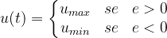
</p>

where *e* is the value assumed by the *error*, difference between the measured output value of the system and the reference.

Obviously the value of  may also be equal to 0, and therefore the value of the control input varies between a maximum value and a value of 0 (actually an *off* value). 

It is for sure a simplified control that has no parameters to determine, if not the limit values that the control input can assume. Its variation can mainly take place according to different logics, illustrated below. Thanks to the use of one of these, it is also possible to define what actually must happen when the error value is equal to 0.

<p align="center">
  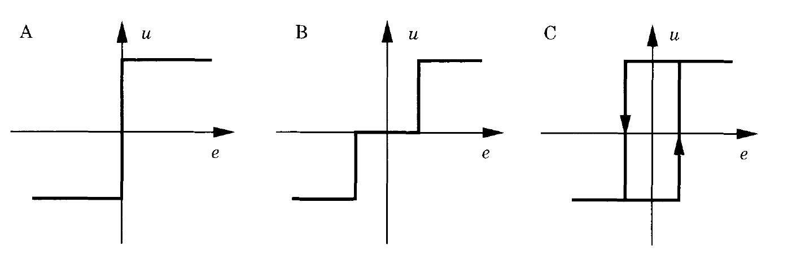
</p>

In figure A the ideal characteristic, in figure B a representation of the on-off scheme with the introduction of a *dead band* and in figure C the representation of the on-off control scheme with *hysteresis*.

</br>

## Proportional–Integral–Derivative Controller (PID)

In industrial applications and generally in automatic control, very often "standard" regulators are used, thanks to which it is possible to obtain the desired performance through the calibration (*tuning*) of a few parameters. Surely the **PID** belongs to this family of controllers: in fact it is the most used controller in the industrial field.

The **PID** is a dynamic controller that provides a control action *proportional* to the error (*e(t)*), its *integral* and its *derivative*:

<p align="center">
  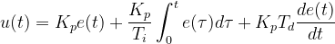
</p>

Framed within a classic feedback scheme, the **PID** is presented in this form:

<p align="center">
  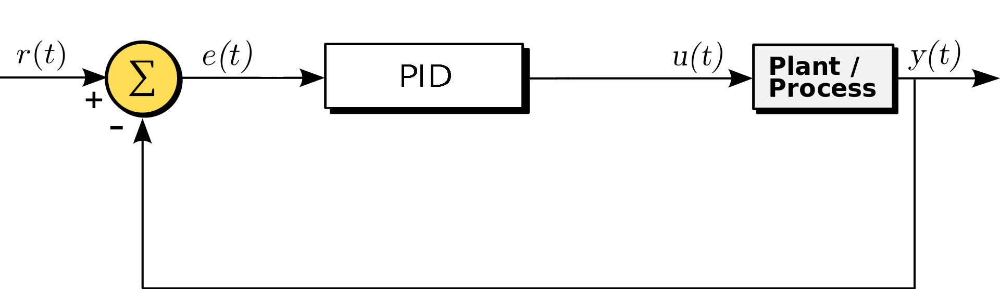
</p>

or, expanding it and highlighting the three components that make it up:

<p align="center">
  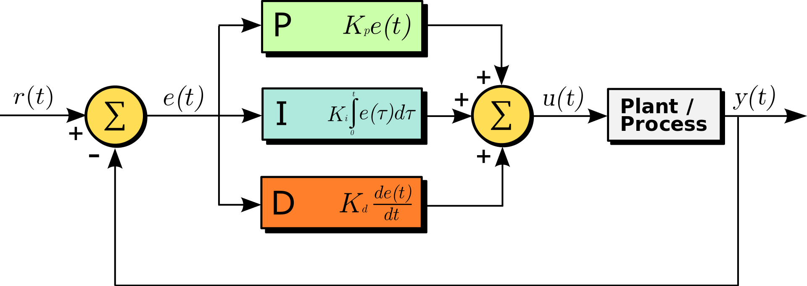
</p>


The parameters *Kp* *Ti* and *Td* are called respectively: *proportional gain*, *integral time constant* and *derivative time constant*; by varying these three parameters it is possible to modify the performance of the control system, as shown in the following table.

| | Stabilty| |  |  |
|:-:|:-:|:-:| :-: | :-: |
| :arrow_up: | decrease |decrease |decrease |increase|
| :arrow_down:| decrease |null |decrease |increase|
| :arrow_up:| better performance |N.D. |N.D. |decrease|

The general effect due to the three distinct components of the regulator can be appreciated by simulating the operation of the **PID** implemented with different structures, for example in a classic *step servo* problem.

<p align="center">
  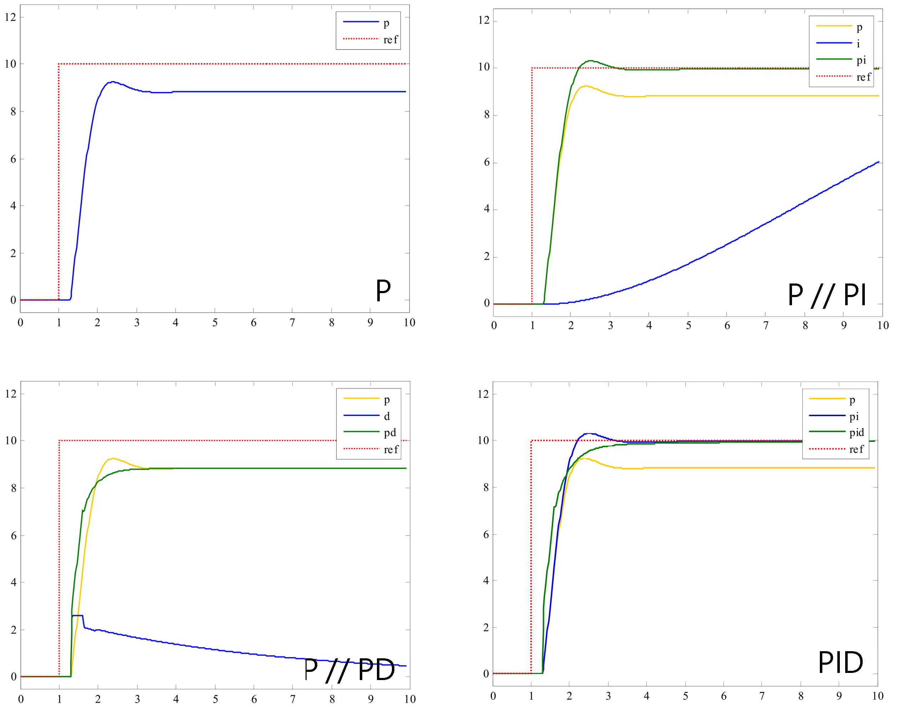
</p>

The results show that the combined action of the three components makes it possible to efficiently solve the control problem; the only component that can sensibly be used alone is the proportional one, which however needs some integral term to be able to reset the error at steady state. If this component is not already present in the system to be controlled, it is important to introduce the integral action, which mathematically represents the area subtended by the curve expressed by ) and ensures that the controller has memory of the past values of the error.

The derivative term instead allows the **PID** to have a prediction capacity thanks to which it is possible to obtain a *smoothing* effect of the response of the controlled system. In fact, increasing the parameter *Td* decreases the overshoot of the system and a linear prediction of the following error is realized, thanks to which it is possible to "slow down" the response of the system before it moves too far from the reference signal. Furthermore, thanks to a 90 degree increase in phase of the feedback system, it improves stability. However, it is important to note that the derivative term tends to amplify high frequency signals and therefore also measurement disturbances. These considerations are derived from the frequency analysis of the regulator and, as a final effect, there could be a control action that turns out to be "nervous".

Furthermore, in the case of step reference signals, which has discontinuities of the first kind, the control action due to the derivative effect alone would theoretically be of infinite value and the control signal would therefore assume exaggerated values, of an impulsive nature. This practically results in potential damage to the actuators or the system.

A final consideration concerns the physical feasibility of the derivative term: if analyzed, one realizes that it is a non-causal system, which requires knowledge of future signals. For a causal implementation this term is filtered with a *low pass filter* which performs two important functions: it makes the differentiator physically realizable and compensates for the effects of the measurement noise in high frequency.

The component that concerns only the derivative part therefore becomes:

<p align="center">
  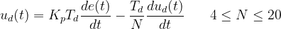
</p>

the introduction of the filter appears even clearer if the formulation is expressed in the *Laplace domain*:

<p align="center">
  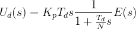
</p>

### Digital Implementation of a PID Controller

In an embedded control system you work with digital signals and a regulator must be reformulated in discrete time, in order to work not with a signal in the time domain but with a sequence of samples (for example  for the error), consequently the regulator will supply the system with a sequence of control inputs (). What should vary, in the classic formulation of a **PID**, are essentially the integral and derivative parts.

The integral term can be approximated, at time *n*, with the sum of the rectangles having a base equal to the sampling period  and height value equal to [e_{kTc}](https://render.githubusercontent.com/render/math?math=e_%7BkTc%7D), with . 
The derivative term can be approximated to step *n* with the incremental ratio between the samples Tc%7D) and . This is the most intuitive and simplest approximation, in fact you can refer to three main methods of discretization indicated as *forward differences*, *backward differences* and *Tustin's method* (or *bilinear transformation*).

<p align="center">
  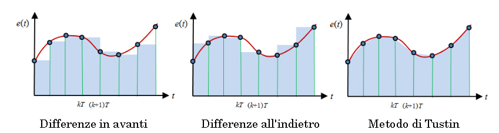
</p>

With the approximations indicated, the **PID** formulation obtained is the following (replacing the subscript *n* used for writing convenience with *nTc* to be more precise):

<p align="center" >
  
</p>

Although implementable and functional, this equation is computationally expensive due to the summation used to approximate the integral: this requires storing all the past samples of the error. To limit this computational weight and the amount of information to be stored, it is possible to practice a reformulation of the equation in terms of a recursive function, defining the difference between the control action at step *n* and that at step *n-1*.

<p align="center">
  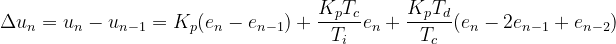
</p>

hence the recursive control action:

<p align="center">
  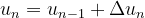
</p>

which, requiring the storage of a few more variables, however, shows itself as a definitely implementable formulation.

It is possible to derive another more interesting recursive formulation that uses the past terms of the input only in the integral and derivative parts and also implements the latter in filtered form, with the low-pass filter shown above. The integral contribution is shown separately in the following equations  and the derivative .

<p align="center">
  
</p>

### Integral Action Desaturation Techniques


The presence of the integral effect in a **PID**, has the side effect of giving rise to a signal that grows indefinitely in amplitude if the error value remains constant. From a practical point of view, this negatively affects the plant actuators, which inevitably have physical limitations due to which it is not possible to provide an action above (or below) certain physical limits. For this reason it is good to take into account *saturation* effects when modeling the control signal for the actuators.

When working with actuators that have, for obvious reasons, a saturation and the integral effect is not properly managed, the phenomenon known as *windup of the integral action* occurs. To avoid this (also avoiding physical deterioration of the system), different strategies called *anti-windup* can be adopted, with which it is possible to saturate the **PID** controller so that, when the actuator enters saturation, the integration of the control error freezes or even decreases.

<p align="center">
  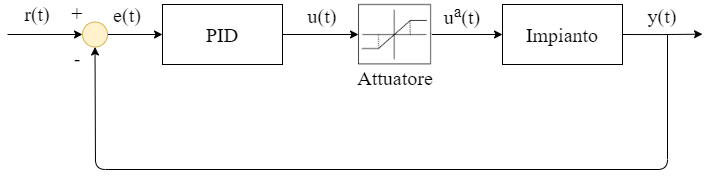
</p>


Considering an actuator with saturation, we can determine this relationship between the control input and the signal processed by the actuator:

<p align="center">
  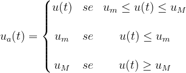
</p>


Starting from these considerations it is possible to structure the controller, for example a **PI**, with the following continuous time formulation:

<p align="center">
  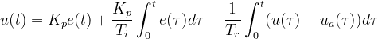
</p>

Note that the last term contributes a value of 0 until the actuator goes into saturation and therefore until it operates in a linear region with %20%3D%20u(t)). As soon as the actuator enters the saturation regime, a discrepancy is created between the inputs, which has an effect of "desaturation of the integral action" with weight determined by the term . 


The purpose of this simple strategy is to decrease the value of the control input as soon as one enters the saturation limits determined by the actuator (information which in any case must be obtained from a mathematical model or in an empirical way). Obviously there could be a deterioration in terms of performance, which can be stemmed by appropriately setting the parameter . 

Note that a similar effect can also be obtained by directly subtracting the integral of the error and not of the discrepancy between the inputs.

### Software Implementation 

Starting from discrete time formulations, it is possible to obtain algorithmic forms for a **PID** controller. It is important to take into consideration the entire control scheme in which it will be inserted, in the context of an embedded control system.

<p align="center">
  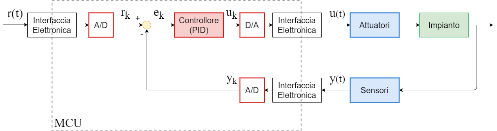
</p>


Once the entire system has been developed in terms of hardware peripherals to be used, the part of software that deals with the **PID** can be thought of as part of a dedicated library which (in **C** language) will be composed from a *header* file and its implementation. The main functions to export to this library concern:

* The initialization of the **PID** - which can be conveniently thought of as a structure containing the parameters necessary for its operation;
* The computation of the control action - which thanks to the knowledge of the current error will determine the control action *u(t)*;
* The management of an *anti-windup* policy;
* The complete reset of the structure or the updating of its fields.

The criterion that can be used in the `main` is to use a *timer* which triggers every *Tc* and commands, in the main life cycle, the calculation of the control law to be applied on the actuators.
```c
while(1) {
  ...
  if(Tc_flag == 1) {
    r = get_reference();    // Reference Value
    y = get_measurement();  // Measurement value

    u = PID_calculate(r, y, &PID_struct); // Calculate input

    set_input(u);           // Set input to actuator

    Tc_flag = 0;
  }
}
```

The `PID_calculate` function, found in the library for the **PID** controller, will take care of implementing the control algorithm according to one of the formulations shown, possibly introducing an adequate *anti-windup* effect.

<p align="center">
  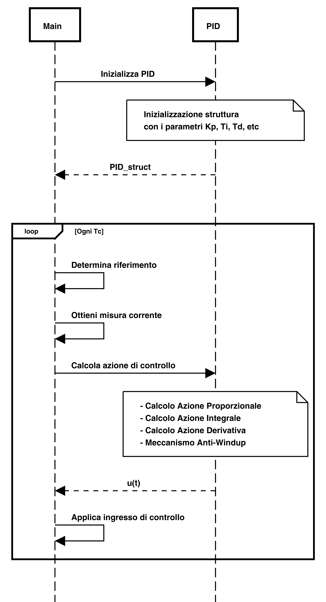
</p>

###  Outline of the main calibration techniques

The calibration of a **PID** is the crucial process by which this regulator can be used effectively. Outlining precise and absolutely valid rules is not practicable. In fact, very often the calibration of these regulators is carried out empirically, following a first adjustment that makes use of a series of techniques based, possibly, also on the model of the system to be controlled.

The first calibration method, also used today, was developed in the 1940s and is called the "Ziegler – Nichols method". This is a very simple heuristic method that does not necessarily require knowledge of the system model and is based on the search for a particular value called "critical gain", from which the other parameters of the **PID** can be derived based on known relationships. The method is carried out according to two possible ways, a first called *closed loop* as the system is put into feedback with a **PID** which contains only the proportional component and this is increased by bringing the whole system to the limit stability, in a condition of permanent oscillation.


<p align="center">
  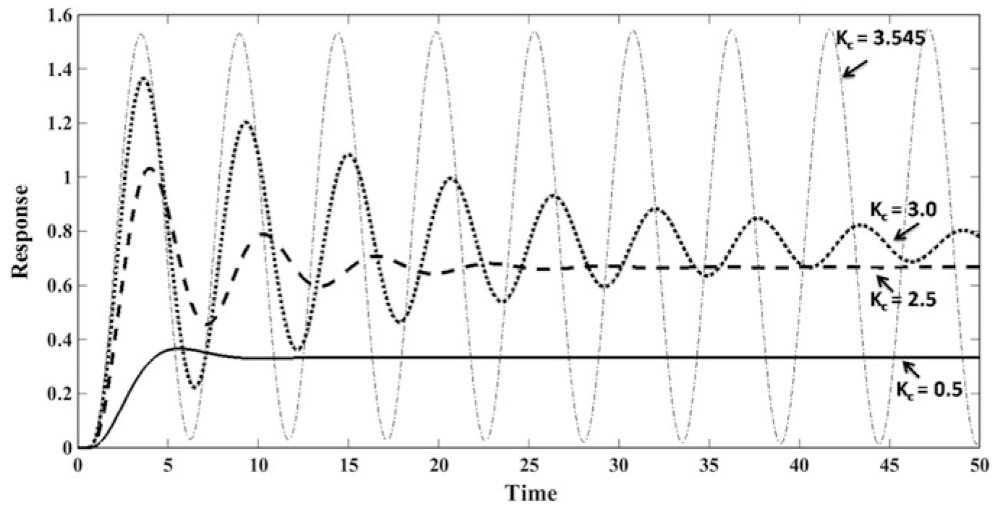
</p>


At this point the period of the oscillations and the gain for which these oscillations occur are determined and reference is made to a known table to obtain the values of *Kp*, *Td* and * Ti *.

|  | *Kp* | *Ti* | *Td* |
|:-:|:-:|:-:|:-:|
|**P**| 0.5 *Kcr* | - | - |
|**PI**|0.45 *Kcr* | *Tcr*/1.2 | - |
|**PD**| 0.8 *Kcr* | - | *Tcr*/8 |
|**PID**| 0.6 *Kcr* | *Tcr*/2 | *Tcr*/8 |

As you can imagine, the method is not always practicable from a physical point of view, more likely from a simulation point of view, which however requires the knowledge of the mathematical model of the system to be simulated.

This method, and others similar, which still manage to guarantee the stability of the system, do not always allow satisfactory results to be obtained and it is necessary to resort to more advanced calibration methods, often based on the mathematical model of the system to be controlled. In these cases, since the mathematical modeling never really reflects the physical system, it is advisable to perform a second phase of empirical calibration of the values.

In cases where the model of the system is known, it is possible to carry out a first calibration phase using *Matlab* and in particular the tool [PID Tuner](https://it.mathworks.com/help/slcontrol/ug/designing-controllers-with-the-pid-tuner.html),  thanks to which it is possible to visually calibrate the **PID** and extract the parameters of its three components.

For the empirical calibration phase it is however good to use the main relationships that link the **PID** parameters to the effects on the controlled system, previously mentioned in the table. Typically the controller is designed according to the following steps: 

* Determination of the response of the open loop system (if possible) to get an idea of what the changes must be made with the control;
* Insertion of a proportional effect to decrease the rise time, increasing the readiness of the system, but taking into account the fact is that increasing it too much would result in a less stable system;
* Insertion of an integral effect to eliminate errors in steady state;
* Insertion of a derivative effect to decrease overshoot and settling time, improving stability and offering the possibility of increasing the proportional effect;
* Repeated measurement of the response of the controlled system and definitive * tuning * of the three characteristic parameters of the three components, until the desired response is obtained.
* 
Finally, it is important to keep in mind that it is not always necessary to implement a complete **PID**, with all three components: sometimes a **PD** may be enough (if the system to be controlled already has integral effects internally ) or a **PI**, which is generally sufficient to solve a lot of control problems.

***
